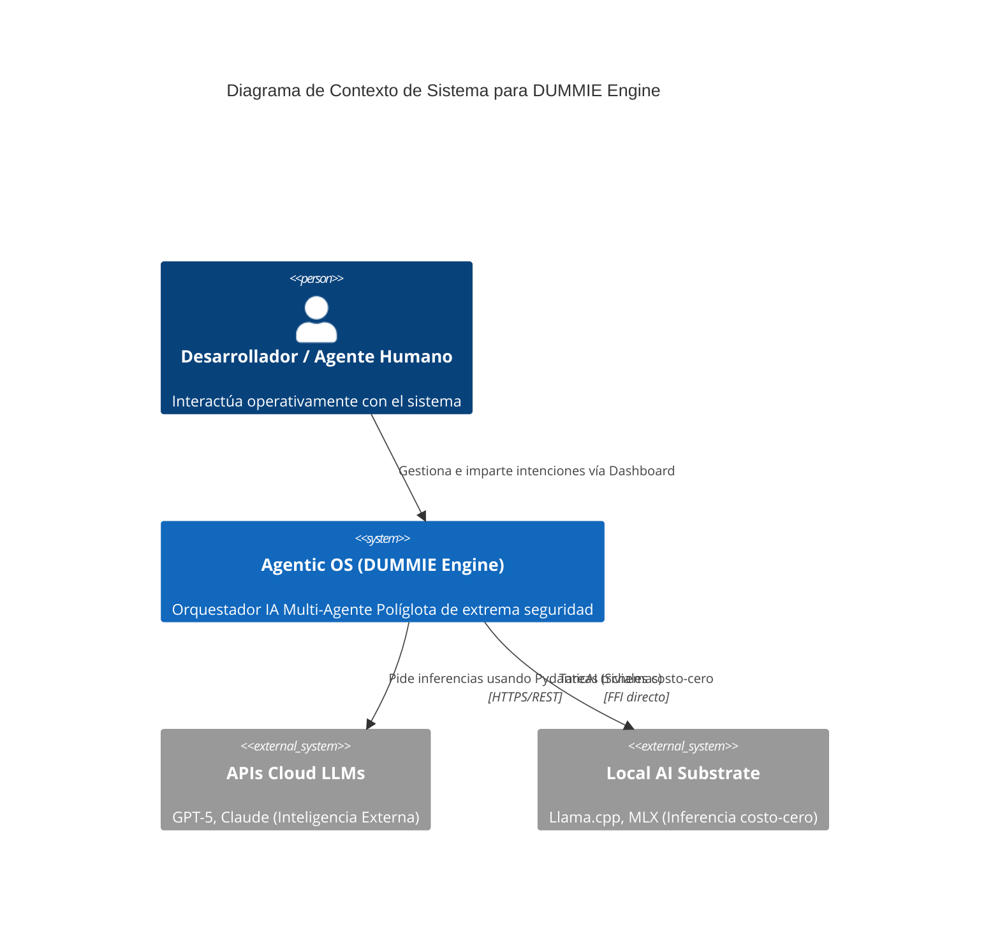
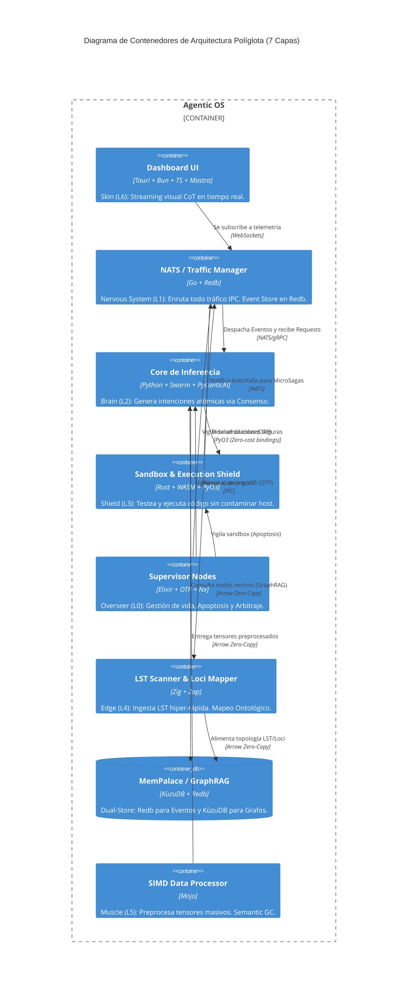
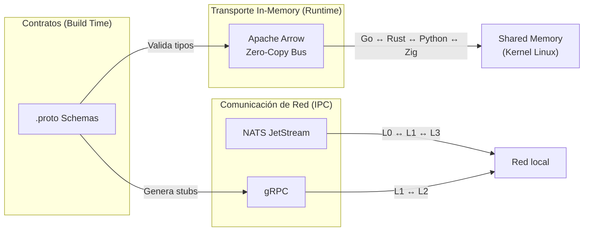

# System Design Blueprint (Modelos C4)

## Abstract
Este documento modela visualmente cómo interactúan e intercambian flujos las capas estructurales de DUMMIE Engine, usando nomenclatura C4. Proporciona una visión holística de la topología del sistema, los contenedores por capa y los contratos de comunicación inter-capa (NATS, Arrow, gRPC).

## 1. Cognitive Context Model (Ref)
Para la definición de niveles de diagramación, tecnologías de transporte y mapeo estratigráfico, consulte el archivo hermano [c4_model_graphs.rules.json](./c4_model_graphs.rules.json).

---

## 2. Nivel 1: Contexto de Sistema

---

## 3. Nivel 2: Diagrama de Contenedores

---

## 4. Nivel 3: Flujo de Datos Inter-Capa (Protocolos)

---

## [MSA] Sibling Components Requeridos
Todo documento maestro debe ir acompañado de sus archivos hermanos para convertirse en una *Active Architectural Fitness Function*:
- **Executable Contract:** [c4_model_graphs.feature](./c4_model_graphs.feature)
- **Machine Rules:** [c4_model_graphs.rules.json](./c4_model_graphs.rules.json)
