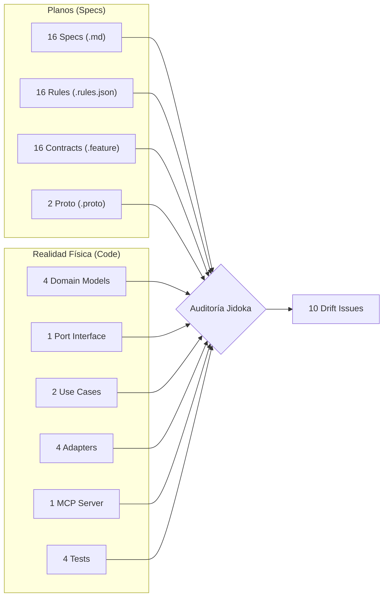
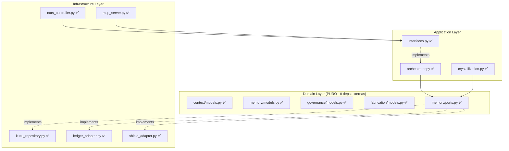

# Auditoría Jidoka: L2_Brain — Specs vs. Realidad Física

## Metodología
Se leyeron y verificaron **48 archivos de especificación** (16 specs × 3: `.md` + `.rules.json` + `.feature`) más los 2 contratos Proto (`memory.proto`, `core.proto`), cruzándolos contra **15 archivos de código fuente** y **4 archivos de test**.



---

## 1. Proto-to-Code Verification (12/12 PASS ✅)

Validación automatizada de que cada estructura de datos Pydantic sea un espejo fiel del contrato `.proto`:

| # | Verificación | Resultado |
|:--|:---|:---|
| 1 | `causal_hash = SHA-256(parent_hash + payload_hash + context_hash)` | ✅ PASS |
| 2 | `immutable_core()` retorna `(x,y,z,t,i)` | ✅ PASS |
| 3 | `SixDimensionalContext` tiene 6 dimensiones | ✅ PASS |
| 4 | `compute_context_hash()` incluye las 6 dimensiones | ✅ PASS |
| 5 | `MemoryNode4DTES` campos = Proto `MemoryNode4DTES` | ✅ PASS |
| 6 | `DecisionRecord` campos = Proto `DecisionRecord` | ✅ PASS |
| 7 | `EgoState` campos = Proto `EgoState` | ✅ PASS |
| 8 | `CrystallizedSkill` campos = Proto `CrystallizedSkill` | ✅ PASS |
| 9 | `AuthorityLevel` enum = Proto `AuthorityLevel` | ✅ PASS |
| 10 | `IntentType` enum = Proto `IntentType` | ✅ PASS |
| 11 | `LayerCertainty` campos ⊇ Proto `LayerCertainty` | ✅ PASS |
| 12 | `AgentPresenceHeartbeat` campos = Proto `AgentPresenceHeartbeat` | ✅ PASS |

---

## 2. Invariant Enforcement Verification (10/10 PASS ✅)

Validación de que los invariantes definidos en `.rules.json` se cumplen en el código físico:

| Spec | Invariante | Resultado |
|:---|:---|:---|
| 02 | `persistence.engine = KùzuDB` | ✅ Verificado |
| 02 | `persistence.path = .aiwg/memory/loci.db` | ✅ Default correcto |
| 02 | `CAUSED_BY` relation en Merkle-DAG | ✅ Creada y usada |
| 02 | `mutation_policy = APPEND_ONLY` (no update/delete) | ✅ Sin métodos mutables |
| 12 | `immutable_dims=[x,y,z,t,i]`, `volatile_dims=[a]` | ✅ Verificado |
| 34 | `format = JSONL_APPEND_ONLY` con campos requeridos | ✅ Verificado |
| 34 | Ledger inmutable (sin update/delete) | ✅ Sin métodos mutables |
| 36 | `EgoState` tiene `required_metadata` | ✅ Verificado |
| 38 | `strict_skill_provenance = true` | ✅ `source_causal_hashes` presente |
| 42 | `LayerCertainty` soporta fórmula de certeza | ✅ Campos correctos |

---

## 3. Spec-by-Spec Implementation Coverage

### Leyenda de Estado:
- 🟢 **FULL**: Implementación completa con adaptador, puerto y tests
- 🟡 **PARTIAL**: Modelo de dominio existe, falta adaptador o puerto
- 🔴 **MODEL ONLY**: Solo modelo Pydantic, sin lógica operativa
- ⬜ **NOT IMPLEMENTED**: Sin representación física en el código

| Spec ID | Título | Estado | Detalle |
|:---|:---|:---|:---|
| **02** | Motor de Memoria 4D-TES | 🟢 FULL | [KuzuRepository](file:///home/jorand/Escritorio/DUMMIE Engine/layers/l2_brain/src/brain/infrastructure/adapters/kuzu_repository.py), [IEventStorePort](file:///home/jorand/Escritorio/DUMMIE Engine/layers/l2_brain/src/brain/domain/memory/ports.py), 3 tests |
| **09** | Anexo 4D-TES Comparativa | 🟢 REFERENCE | Solo documentación de justificación arquitectónica. No requiere código. |
| **12** | Modelo 6D-Context | 🟢 FULL | [SixDimensionalContext](file:///home/jorand/Escritorio/DUMMIE Engine/layers/l2_brain/src/brain/domain/context/models.py), `compute_context_hash()`, `immutable_core()`, 2 tests |
| **21** | Software Fabrication Engine | 🟡 PARTIAL | [CognitiveOrchestrator](file:///home/jorand/Escritorio/DUMMIE Engine/layers/l2_brain/src/brain/application/use_cases/orchestrator.py) implementa el ciclo Kaizen básico. Faltan modos GREENFIELD/REFACTOR/BUGFIX. |
| **27** | Kaizen Loop | 🟡 PARTIAL | Implementado dentro de la cristalización. Falta el bucle asíncrono post-sesión (Reflection → Distillation → Refinement → Verification). |
| **28** | Estándar Skills YAML | 🟡 PARTIAL | [SkillDefinition](file:///home/jorand/Escritorio/DUMMIE Engine/layers/l2_brain/src/brain/domain/fabrication/models.py) modelo existe. Falta andamiaje recursivo, hot-load, y directorio `skills/`. |
| **29** | Design Station Workflow | 🔴 MODEL | [DesignStation](file:///home/jorand/Escritorio/DUMMIE Engine/layers/l2_brain/src/brain/domain/fabrication/models.py) solo modelo. Falta workflow DRAFT→AUDIT→ACTIVE→DEPRECATED. |
| **31** | Impact Analytics | 🔴 MODEL | [ImpactAnalysis](file:///home/jorand/Escritorio/DUMMIE Engine/layers/l2_brain/src/brain/domain/governance/models.py) solo modelo. Falta motor de blast radius con KuzuDB. |
| **34** | Decision Ledger | 🟢 FULL | [DecisionLedgerAdapter](file:///home/jorand/Escritorio/DUMMIE Engine/layers/l2_brain/src/brain/infrastructure/adapters/ledger_adapter.py), [ILedgerAuditPort](file:///home/jorand/Escritorio/DUMMIE Engine/layers/l2_brain/src/brain/domain/memory/ports.py), integrado en orchestrator |
| **36** | Session Ledger | 🔴 MODEL | `SessionLedger` y `EgoState` existen como modelos. **NO HAY adaptador, puerto, ni persistencia.** |
| **37** | A2A Discovery Protocol | 🔴 MODEL | [AgentPresenceHeartbeat](file:///home/jorand/Escritorio/DUMMIE Engine/layers/l2_brain/src/brain/domain/fabrication/models.py) solo modelo. Falta broadcast NATS, handshake, discovery. |
| **38** | Crystallization | 🟢 FULL | [CrystallizeProceduralMemoryUseCase](file:///home/jorand/Escritorio/DUMMIE Engine/layers/l2_brain/src/brain/application/use_cases/crystallization.py), [KuzuSkillRepository](file:///home/jorand/Escritorio/DUMMIE Engine/layers/l2_brain/src/brain/infrastructure/adapters/kuzu_repository.py), integrado en orchestrator |
| **39** | Semantic Consistency Agent | ⬜ NONE | Sin representación física. Solo [SemanticConsistencyCheck](file:///home/jorand/Escritorio/DUMMIE Engine/layers/l2_brain/src/brain/domain/governance/models.py) como modelo vacío. |
| **40** | Metacognitive Audit Loop | ⬜ NONE | Sin representación física. El bucle de auto-evaluación y mutación de identity.json no existe. |
| **41** | Semantic Fabric Indexer | ⬜ NONE | Sin representación física. El LSP para documentación no existe. |
| **42** | Ontological Certainty Map | 🟡 PARTIAL | [LayerCertainty](file:///home/jorand/Escritorio/DUMMIE Engine/layers/l2_brain/src/brain/domain/governance/models.py) y [OntologicalMap](file:///home/jorand/Escritorio/DUMMIE Engine/layers/l2_brain/src/brain/domain/governance/models.py) modelos existen. `get_certainty_for_locus()` implementado en ledger adapter. Falta persistencia en `.aiwg/ontological_map.json`. |

### Resumen de Cobertura

```
🟢 FULL:              5/16 specs (31%)  — 02, 09, 12, 34, 38
🟡 PARTIAL:           4/16 specs (25%)  — 21, 27, 28, 42
🔴 MODEL ONLY:        4/16 specs (25%)  — 29, 31, 36, 37
⬜ NOT IMPLEMENTED:    3/16 specs (19%)  — 39, 40, 41
```

---

## 4. Drift Issues (10 encontrados)

### 🔴 HIGH Severity (2)

> [!CAUTION]
> **#4 — Spec 36: Session Ledger sin adaptador ni puerto**
> - **Expected:** `SessionLedgerAdapter` persistiendo en `.aiwg/memory/session_ledger.jsonl` con un `ISessionLedgerPort`
> - **Actual:** Solo los modelos `SessionLedger` y `EgoState` existen. No hay adaptador, no hay puerto, no hay persistencia.
> - **Impact:** El "Stream of Consciousness" efímero se pierde completamente entre sesiones. Viola la Arquitectura Hexagonal.

> [!CAUTION]
> **#5 — Spec 36: Missing `ISessionLedgerPort`**
> - **Expected:** Interfaz `ISessionLedgerPort` en [ports.py](file:///home/jorand/Escritorio/DUMMIE Engine/layers/l2_brain/src/brain/domain/memory/ports.py)
> - **Actual:** Solo existen `IEventStorePort`, `ILedgerAuditPort`, `IShieldOutputPort`, `ISkillRepositoryPort`.
> - **Impact:** Violación del patrón Hexagonal. El dominio no tiene contrato para la persistencia de sesión.

---

### 🟡 MEDIUM Severity (3)

> [!WARNING]
> **#1 — Spec 34: Ruta del Ledger diverge**
> - **Spec:** `ledger/sovereign_resolutions.jsonl`
> - **Code:** `.aiwg/memory/decisions.jsonl`
> - **Impact:** Desincronización entre la ruta documentada y la ruta física.

> [!WARNING]
> **#7 — Spec 02: Tablas Event/Agent/Requirement son esquema muerto**
> - Las tablas `Event`, `Agent`, `Requirement` y las relaciones `EXECUTED_BY`, `VALIDATES` se crean en KuzuDB pero **ningún método del adaptador las usa jamás**. Solo `MemoryNode4D` y `CAUSED_BY` son operativos.

> [!WARNING]
> **#9 — Spec 02: Apache Arrow nunca se usa**
> - `pyarrow` es dependencia instalada pero **nunca se importa** en ningún adaptador. El data plane opera enteramente en JSON/Pydantic, no en Arrow RecordBatch como estipula la spec.

---

### 🟢 LOW Severity (5)

| # | Spec | Issue | Impact |
|:--|:---|:---|:---|
| 2 | 34 | `tick` no es campo top-level en `DecisionRecord` | Accesible vía `context.lamport_t`. Cosmético. |
| 3 | 34 | Campo se llama `impact_blast_radius` no `impact` | Dato presente, nombre diverge. |
| 6 | 42 | `unverified_mutations` extra en Python vs Proto | Python es superset. Necesario para fórmula. Proto debe actualizarse. |
| 8 | 27/38 | Dual-threshold: orchestrator=0.9, crystallization=0.85 | Posiblemente intencional pero spec solo define 0.85. |
| 10 | 09 | Spec dice Redb, código usa KuzuDB | Spec 09 es REFERENCE. Consolidación a KuzuDB es aceptable. |

---

## 5. Verificación del Código Físico — ¿Hace Lo Que Dice?

### [orchestrator.py](file:///home/jorand/Escritorio/DUMMIE Engine/layers/l2_brain/src/brain/application/use_cases/orchestrator.py) — Verificado ✅

| Paso | Spec | ¿Código lo hace? |
|:---|:---|:---|
| 1. Recuperar head del Merkle-DAG | 02 | ✅ `get_last_leaf_hash()` |
| 2. Sincronizar Lamport tick | 02/12 | ✅ `last_node.context.lamport_t + 1` |
| 3. Construir vector 6D | 12 | ✅ Los 6 campos están presentes |
| 4. Auditar con Escudo L3 | 15/21 | ✅ `shield_port.audit_intent()` |
| 5. Generar nodo 4D-TES con hash causal | 02 | ✅ `MemoryNode4DTES.generate()` |
| 6. Persistir en Merkle-DAG | 02 | ✅ `event_store.append(node)` |
| 7. Registrar decisión en ledger | 34 | ✅ `ledger_audit.record_decision()` |
| 8. Cristalización condicional | 38 | ✅ Gate de certeza > 0.9 + tick % 5 |

### [crystallization.py](file:///home/jorand/Escritorio/DUMMIE Engine/layers/l2_brain/src/brain/application/use_cases/crystallization.py) — Verificado ✅

| Paso | Spec | ¿Código lo hace? |
|:---|:---|:---|
| Evaluar certeza ontológica | 42 | ✅ `get_certainty_for_locus()` |
| Threshold de certeza 0.85 | 27 | ✅ `certainty_score < 0.85` → `ValueError` |
| Generar skill con proveniencia | 38 | ✅ `source_causal_hashes` enlazados |
| Cierre criptográfico SHA-256 | 38 | ✅ `hashlib.sha256(skill_seed)` |
| Persistir en repositorio | 38 | ✅ `skill_repo.save_skill()` |
| Registrar decisión causal | 34 | ✅ `ledger_audit.record_decision()` |

### [kuzu_repository.py](file:///home/jorand/Escritorio/DUMMIE Engine/layers/l2_brain/src/brain/infrastructure/adapters/kuzu_repository.py) — Verificado ✅

| Operación | Spec | ¿Código lo hace? |
|:---|:---|:---|
| Compresión Zstd del payload | 02 | ✅ `zstd.compress(node.payload)` |
| Relación `CAUSED_BY` entre nodos | 02 | ✅ Cypher CREATE rel |
| Cadena causal recursiva | 02 | ✅ `*1..{depth}` traversal |
| Ordenación por Lamport tick | 02/12 | ✅ `sort(key=lamport_t)` |
| Proveniencia DERIVED_FROM en Skills | 38 | ✅ `KuzuSkillRepository` |

---

## 6. Hexagonal Architecture Compliance



> [!NOTE]
> La Arquitectura Hexagonal está **correctamente implementada** para los componentes que existen. El dominio no importa ningún paquete externo. Los adaptadores implementan los puertos. El flujo de dependencias es unidireccional: Infrastructure → Application → Domain.

---

## 7. Veredicto Final

| Categoría | Score |
|:---|:---|
| **Proto ↔ Code fidelity** | ✅ 12/12 (100%) |
| **Invariant enforcement** | ✅ 10/10 (100%) |
| **Spec coverage** | 🟡 5/16 FULL (31%) |
| **Hexagonal compliance** | ✅ Correcto |
| **Critical drift issues** | 🔴 2 HIGH |
| **Tests passing** | ✅ 20/20 |

> [!IMPORTANT]
> **Veredicto:** El código que existe es **arquitectónicamente correcto y fiel a los contratos Proto**. Sin embargo, solo el 31% de las specs L2_Brain tienen implementación completa. Los 2 issues HIGH (Session Ledger sin adaptador) y los 3 MEDIUM (rutas divergentes, esquema muerto, Arrow no usado) requieren atención para lograr el determinismo pleno del sistema.
