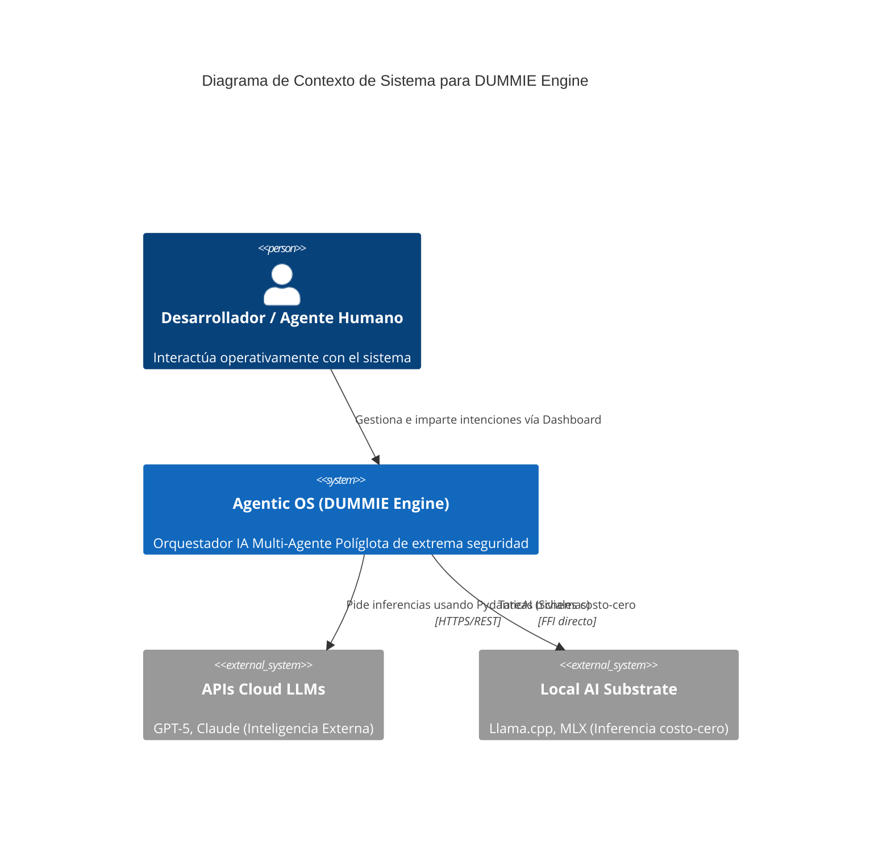
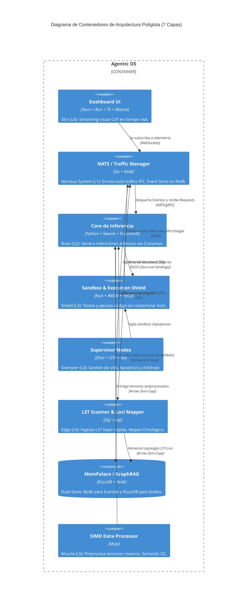
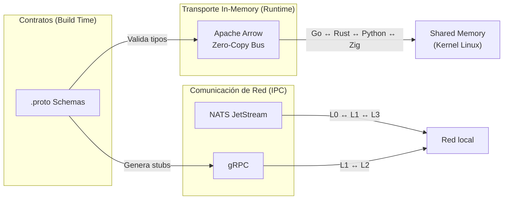

# MANIFIESTO DE VISIÓN: Ingeniería de Sistemas Soberana

## Abstract
DUMMIE Engine es una **Autonomous Software Factory (ASF)** y un **Agentic Enterprise Operating System (AEOS)** diseñado para la orquestación de sistemas de misión crítica sin intervención manual en el código. Este manifiesto establece los axiomas de soberanía, primacía de contratos y consistencia causal que rigen el ecosistema.

## 1. Cognitive Context Model (Ref)
Para los axiomas técnicos y pilares de arquitectura, consulte el archivo hermano [vision_manifesto.rules.json](./vision_manifesto.rules.json).

---

## 2. La Estructura Departamental (Industrial Mapping)
La factoría opera bajo el principio de **Separación de Responsabilidades Industriales**, mapeando sus 7 capas políglotas en cuatro departamentos soberanos:

### 2.1 Dept. de Estrategia e Investigación (L2 Brain / Librarian / Investigator)
Responsable de la intención, el diseño cognitivo y la gestión de la Memoria Semántica. Utiliza el **Context Model de 6 Dimensiones** para eliminar la ambigüedad antes de que llegue a la planta de fabricación.

### 2.2 Dept. de Arquitectura - The Guardian (L3 Shield / L4 Edge / Architect / Sentinel)
El guardián del **Poka-Yoke**. Garantiza que ninguna línea de código viole los contratos estructurales. Si se detecta un riesgo, se activa el **Andon Cord**. Supervisa la integridad de los ADRs y el Grafo de Conocimiento.

### 2.3 Dept. de Ingeniería de Planta (L0 Overseer / L1 Nervous / L5 Muscle / Plant Coder)
La maquinaria pesada. Encargada de la persistencia causal, el multiverso OTP, el procesamiento SIMD y la implementación física de componentes. Es una ejecución determinista e inmutable gestionada por agentes especialistas.

### 2.4 Dept. de QA y Auditoría (Active Shields / Auditor / Quality Gate)
Validación continua mediante **Jidoka**. El sistema se auto-inspecciona en tiempo real, colapsando la onda de probabilidad solo cuando se alcanza el consenso de integridad total y el cumplimiento de los Shields (S, E, L).

---

## 3. El Axioma de la Oficina Virtual (Consenso de Expertos)
Rechazamos la generación de código lineal y estocástica. En la **Oficina Virtual**, la comunicación entre agentes es una coreografía de ingeniería multidisciplinaria:
- **Disidencia Constructiva:** Los agentes deben desafiar propuestas que violen la integridad del sistema.
- **Jerarquía Ejecutiva:** El Árbitro de [Elixir (L0)](../specs/L0_Overseer/03_polyglot_architecture.md) resuelve impases.

---

## 4. Los Pilares de la Soberanía Agéntica

### I. Primacía de la Ley de Schema-First
Todo comportamiento sistémico reside en contratos inmutables ([**Protobuf**](../specs/L1_Nervous/10_protobuf_contracts.md)).

### II. Modularidad Atómica y Desacoplamiento Hexagonal
El software nace modular por diseño. Cada componente es un [**Nodo Atómico (Spec 23)**](../specs/L1_Nervous/23_atomic_modular_nodes.md).

### III. Consistencia Causal (4D-TES)
La verdad no es un estado estático, sino una línea de universo inmutable. La memoria multiplexada ([Spec 02](../specs/L2_Brain/02_memory_engine_4d_tes.md)) garantiza la trazabilidad.

### IV. Interoperabilidad Universal (MCP / USB-C)
El sistema se estandariza mediante el **Model Context Protocol (MCP)**. La memoria, las herramientas y el contexto son accesibles como si de un puerto USB-C se tratara, permitiendo la integración "Plug & Play" de cualquier agente de IA o sistema externo con el ecosistema DUMMIE.

---

## 5. Conclusión
DUMMIE Engine es el martillo que forja software soberano y resiliente, operado por una inteligencia colectiva que razona con el rigor de un maestro arquitecto.

---

## [MSA] Sibling Components Requeridos
Todo documento maestro debe ir acompañado de sus archivos hermanos para convertirse en una *Active Architectural Fitness Function*:
- **Executable Contract:** [vision_manifesto.feature](./vision_manifesto.feature)
- **Machine Rules:** [vision_manifesto.rules.json](./vision_manifesto.rules.json)
---
spec_id: "DE-V2-L0-PROTOCOL"
title: "Protocolo de Ingesta y Cristalización Cognitiva"
status: "ACTIVE"
version: "1.2.0"
layer: "L0"
namespace: "io.dummie.v2.foundation"
authority: "ARCHITECT"
tags: ["foundation", "cognitive_protocol", "memory_management"]
---

# Protocolo de Ingesta y Cristalización Cognitiva

## Abstract
Este protocolo rige cómo los agentes (L2 Brain) deben consumir y generar conocimiento dentro del DUMMIE Engine. Su misión es garantizar la soberanía de la información, evitar la duplicidad de errores y asegurar que todo aprendizaje sea cristalizado de forma determinista en el Ledger del sistema. **La comunicación se estandariza mediante MCP (Model Context Protocol), actuando como la interfaz universal (USB-C) entre el motor y los agentes.**

## 1. Cognitive Context Model (Ref)
Para los invariantes técnicos del flujo de memoria, consulte el archivo hermano [COGNITIVE_PROTOCOL.rules.json](./COGNITIVE_PROTOCOL.rules.json).

---

## 2. Procedimiento de Onboarding (Lectura Obligatoria)
Antes de realizar cualquier cambio físico en el monorepo, todo agente DEBE realizar este escaneo secuencial:
1.  **Indexar [ATLAS.md](../ATLAS.md):** Para entender la topología actual del monorepo.
2.  **Escanear [.aiwg/memory/](../../.aiwg/memory/):** 
    -   `decisions.jsonl`: ¿Se ha decidido algo antes sobre este componente?
    -   `lessons.jsonl`: ¿Qué falló la última vez que alguien tocó esto?
    -   `ambiguities.jsonl`: ¿Qué dudas resolvió el PAH recientemente?
3.  **Auditar Restricciones Arquitectónicas Activas (ADRs):** El agente Tech Lead (Nodo 3) **DEBE** procesar todos los archivos `.rules.json` en `doc/01_architecture/adr/`. Las reglas de los ADRs con estado `ACCEPTED` son vinculantes.
4.  **Conexión vía MCP:** El agente debe inicializar su sesión conectándose al **DUMMIE Memory MCP Server**, que expone las herramientas de lectura/escritura para `.aiwg` y la base de datos de Loci.

---

## 3. Protocolo de Escritura (Crystallization)
El agente no espera al final de la sesión; cristaliza la memoria en tiempo real tras hitos críticos:

### A. Registro de Decisiones
Si el usuario aprueba un cambio arquitectónico o una implementación Greenfield.
- **Formato:** JSONL alineado con `memory.proto`.
- **Destino:** `.aiwg/memory/decisions.jsonl`.

### B. Registro de Lecciones (Post-Mortem)
Si el agente cometió un error de sintaxis, rompió un test o recibió una corrección del PAH.
- **Formato:** JSONL alineado con `memory.proto`.
- **Destino:** `.aiwg/memory/lessons.jsonl`.

### C. Registro de Ambigüedades
Si el agente tuvo que usar el protocolo `Ask-User-First` para eliminar una indeterminación.
- **Formato:** JSONL alineado con `memory.proto`.
- **Destino:** `.aiwg/memory/ambiguities.jsonl`.

---

## 4. Invariante de Validación
Cualquier entrada de memoria será validada por el **SDD Auditor (doc/04_forge/sdd_validator.py)**. Las entradas que violen el esquema Protobuf de Layer 1 serán marcadas como `CORRUPTED`.

---

## 5. Protocolo de Cierre Soberano (SCCP)
Al final de cada sesión, es MANDATORIO ejecutar el ritual de cierre definido en la **[Spec 49](../specs/L0_Overseer/49_sovereign_cognitive_closure_protocol.md)**.

---

## [MSA] Sibling Components Requeridos
Todo documento maestro debe ir acompañado de sus archivos hermanos para convertirse en una *Active Architectural Fitness Function*:
- **Executable Contract:** [COGNITIVE_PROTOCOL.feature](./COGNITIVE_PROTOCOL.feature)
- **Machine Rules:** [COGNITIVE_PROTOCOL.rules.json](./COGNITIVE_PROTOCOL.rules.json)
---
spec_id: "DE-V2-GOV-02"
title: "System Design Blueprint (Modelos C4)"
status: "ACTIVE"
version: "2.2.0"
layer: "L0"
namespace: "io.dummie.v2.concepts"
authority: "ARCHITECT"
dependencies:
  - id: "DE-V2-[ADR-001](../adr/0001-polyglot-architecture.md)"
    relationship: "REPRESENTS"
tags: ["governance", "system_design", "c4_model", "industrial_sdd"]
---

# System Design Blueprint (Modelos C4)

## Abstract
Este documento modela visualmente cómo interactúan e intercambian flujos las capas estructurales de DUMMIE Engine, usando nomenclatura C4. Proporciona una visión holística de la topología del sistema, los contenedores por capa y los contratos de comunicación inter-capa (NATS, Arrow, gRPC).

## 1. Cognitive Context Model (Ref)
Para la definición de niveles de diagramación, tecnologías de transporte y mapeo estratigráfico, consulte el archivo hermano [c4_model_graphs.rules.json](./c4_model_graphs.rules.json).

---

## 2. Nivel 1: Contexto de Sistema

---

## 3. Nivel 2: Diagrama de Contenedores

---

## 4. Nivel 3: Flujo de Datos Inter-Capa (Protocolos)

---

## [MSA] Sibling Components Requeridos
Todo documento maestro debe ir acompañado de sus archivos hermanos para convertirse en una *Active Architectural Fitness Function*:
- **Executable Contract:** [c4_model_graphs.feature](./c4_model_graphs.feature)
- **Machine Rules:** [c4_model_graphs.rules.json](./c4_model_graphs.rules.json)
# 🗺️ PHYSICAL_MAP: DUMMIE Engine SSoT (Tabula Rasa v2)

## L2_Brain (Sovereign Package)
- Path: `layers/l2_brain/`
- Core: `daemon.py`, `skill_binder.py`, `gateway_contract.py`

## L3_Shield (Flat Adapters)
- Path: `layers/l3_shield/`
- Core: `topological_auditor.py`, `budget_auditor.py`, `compliance_auditor.py`

## L4_Edge (Sensors)
- Path: `layers/l4_edge/`
- Core: `tool_discovery.py`, `lst_scanner.zig`

## L5_Muscle (Muscle)
- Path: `layers/l5_muscle/`
- Core: `mcp_driver.py`, `manager.py`
---
spec_id: "DE-V2-INDEX-00"
title: "Project Headers Index"
status: "ACTIVE"
version: "2.2.0"
layer: "L0"
namespace: "io.dummie.v2.index"
authority: "LIBRARIAN"
dependencies: []
tags: ["index", "metadata", "industrial_sdd"]
---

# Project Headers Index

## Abstract
Este documento actúa como el índice maestro de todas las especificaciones, decisiones arquitectónicas y manifiestos del proyecto DUMMIE Engine. Proporciona una visión rápida de la estructura cognitiva y técnica del sistema, sirviendo como SSOT para la navegación agéntica.

## 1. Cognitive Context Model (Ref)
Para el conteo total de especificaciones, el estado de validación SDD y las reglas de integridad del índice, consulte el archivo hermano [headers.rules.json](./headers.rules.json).

---

## 2. Foundation & Atlas

| ID | Title | Path |
| :--- | :--- | :--- |
| DE-V2-ATLAS | [ATLAS Zero](../ATLAS.md) | `doc/ATLAS.md` |
| DE-V2-GOV-00 | [Vision Manifesto](../00_foundation/vision_manifesto.md) | `doc/00_foundation/vision_manifesto.md` |
| DE-V2-SCCP | [Cognitive Protocol](../00_foundation/COGNITIVE_PROTOCOL.md) | `doc/00_foundation/COGNITIVE_PROTOCOL.md` |
| DE-V2-MAP-01 | [Physical Map](./PHYSICAL_MAP.md) | `doc/02_atlas/PHYSICAL_MAP.md` |

---

## 3. Architectural Decision Records (ADRs)

| ID | Title | Layer | Status |
| :--- | :--- | :--- | :--- |
| DE-V2-ADR-001 | [Polyglot L0-L6](../01_architecture/adr/0001-polyglot-architecture.md) | L0 | ACTIVE |
| DE-V2-ADR-002 | [Ambiguity Res.](../01_architecture/adr/0002-ambiguity-resolutions.md) | L0 | ACTIVE |
| DE-V2-ADR-003 | [Agentic SFE](../01_architecture/adr/0003-agentic-communication-fabrication.md) | L2 | ACTIVE |
| DE-V2-ADR-004 | [Identity & Mood](../01_architecture/adr/0004-project-personality.md) | L0 | ACTIVE |
| DE-V2-ADR-005 | [Cognitive Standards](../01_architecture/adr/0005-cognitive-fabrication-protocols.md) | L0 | ACTIVE |
| DE-V2-ADR-006 | [Hybrid Execution](../01_architecture/adr/0006-sovereign-hybrid-documentation-protocol.md) | L0 | ACTIVE |
| DE-V2-ADR-007 | [Modular Specs (MSA)](../01_architecture/adr/0007-modular-spec-sibling-files.md) | L0 | ACTIVE |
| DE-V2-ADR-008 | [Hierarchical DDD](../01_architecture/adr/0008-hierarchical-domain-specific-documentation.md) | L0 | ACTIVE |
| DE-V2-ADR-009 | [L2 Bounded Contexts](../01_architecture/adr/0009-l2-brain-bounded-contexts.md) | L0 | ACTIVE |
| DE-V2-ADR-010 | [Hybrid Diagramming](../01_architecture/adr/0010-hybrid-diagram-strategy.md) | L0 | ACTIVE |
| DE-V2-ADR-011 | [L2 Memory Bridge](../01_architecture/adr/0011-l2-infrastructure-bridge.md) | L0 | ACTIVE |

---

## 4. Core Specifications (L0-L6)

| ID | Title | Layer | Namespace |
| :--- | :--- | :--- | :--- |
| DE-V2-L0-00 | [Topology Tracker](../specs/L0_Overseer/00_topology_tracker.md) | L0 | .tracker |
| DE-V2-L2-02 | [Memory Engine (4D-TES)](../specs/L2_Brain/02_memory_engine_4d_tes.md) | L2 | .brain.memory |
| DE-V2-L0-03 | [Polyglot Architecture](../specs/L0_Overseer/03_polyglot_architecture.md) | L0 | .architecture |
| DE-V2-L3-04 | [Anti-Ignorance Shields](../specs/L3_Shield/04_anti_ignorance_shields.md) | L3 | .shield |
| DE-V2-L0-05 | [Orchestration Stack](../specs/L0_Overseer/05_orchestration_stack_and_glue.md) | L0 | .orchestrator |
| DE-V2-L0-06 | [Migration Strategy](../specs/L0_Overseer/06_migration_and_implementation_strategy.md) | L0 | .strategy |
| DE-V2-L0-07 | [Unknown Unknowns](../specs/L0_Overseer/07_unknown_unknowns_resolutions.md) | L0 | .resilience |
| DE-V2-L0-08 | [DevEx & Deployment](../specs/L0_Overseer/08_devex_and_deployment_strategy.md) | L0 | .devex |
| DE-V2-L2-09 | [4D-TES Annex](../specs/L2_Brain/09_annex_4d_tes_comparison.md) | L2 | .concepts |
| DE-V2-L1-10 | [Protobuf Contracts](../specs/L1_Nervous/10_protobuf_contracts.md) | L1 | .contracts |
| DE-V2-L0-11 | [Monorepo Structure](../specs/L0_Overseer/11_monorepo_structure.md) | L0 | .structure |
| DE-V2-L2-12 | [6D-Context Model](../specs/L2_Brain/12_6d_context_model.md) | L2 | .brain.context |
| DE-V2-L6-13 | [Observability (OTel)](../specs/L6_Skin/13_observability_opentelemetry.md) | L6 | .observability |
| DE-V2-L0-14 | [Value Engineering](../specs/L0_Overseer/14_value_engineering_and_governance.md) | L0 | .value_engineering |
| DE-V2-L1-15 | [I/O Isolation (FEI)](../specs/L1_Nervous/15_mcp_sidecar_isolation.md) | L1 | .io |
| DE-V2-L5-16 | [IPC Stability](../specs/L5_Muscle/16_hardware_ipc_stability.md) | L5 | .hardware |
| DE-V2-L6-17 | [Optical Nerve](../specs/L6_Skin/17_optical_nerve_telemetry.md) | L6 | .visualizer |
| DE-V2-L4-18 | [Loci Ontology](../specs/L4_Edge/18_loci_ontology_mapping.md) | L4 | .loci |
| DE-V2-L5-20 | [SIMD Muscle (Mojo)](../specs/L5_Muscle/20_simd_muscle_processing.md) | L5 | .muscle |
| DE-V2-L2-21 | [Fabrication Engine](../specs/L2_Brain/21_software_fabrication_engine.md) | L2 | .sfe |
| DE-V2-L3-22 | [Executable Contracts](../specs/L3_Shield/22_sdd_executable_contracts.md) | L3 | .shield.contracts |
| DE-V2-L1-23 | [Atomic Nodes](../specs/L1_Nervous/23_atomic_modular_nodes.md) | L1 | .atoms |
| DE-V2-L3-24 | [Legal Shield](../specs/L3_Shield/24_legal_compliance_shield.md) | L3 | .compliance |
| DE-V2-L4-25 | [Blueprint Registry](../specs/L4_Edge/25_blueprint_registry.md) | L4 | .blueprints |
| DE-V2-L6-26 | [Command Canvas (GUI)](../specs/L6_Skin/26_command_canvas_gui.md) | L6 | .gui.canvas |
| DE-V2-L2-27 | [Kaizen Loop](../specs/L2_Brain/27_kaizen_loop_refinement.md) | L2 | .kaizen |
| DE-V2-L2-28 | [Skill Standard](../specs/L2_Brain/28_skill_standard_yaml.md) | L2 | .skills |
| DE-V2-L2-29 | [Design Station](../specs/L2_Brain/29_design_station_workflow.md) | L2 | .workflow.design |
| DE-V2-L6-30 | [Visualizer Microservice](../specs/L6_Skin/30_visualizer_microservice.md) | L6 | .visualizer.svc |
| DE-V2-L2-31 | [Impact Analytics](../specs/L2_Brain/31_impact_analytics_blast_radius.md) | L2 | .analytics |
| DE-V2-L5-32 | [Multiverse Compression](../specs/L5_Muscle/32_multiverse_compression_necro_learning.md) | L5 | .compression |
| DE-V2-L0-33 | [Project Personality](../specs/L0_Overseer/33_persistent_personality_mood.md) | L0 | .personality |
| DE-V2-L2-34 | [Decision Ledger](../specs/L2_Brain/34_decision_ledger_auditor.md) | L2 | .governance.ledger |
| DE-V2-L5-35 | [Necro-Learning](../specs/L5_Muscle/35_necro_learning_pipeline.md) | L5 | .necro |
| DE-V2-L2-36 | [Cognitive Memory](../specs/L2_Brain/36_cognitive_memory_session_ledger.md) | L2 | .memory.session |
| DE-V2-L2-37 | [A2A Discovery](../specs/L2_Brain/37_a2a_discovery_protocol.md) | L2 | .cognitive.a2a |
| DE-V2-L2-38 | [Procedural Memory](../specs/L2_Brain/38_procedural_memory_crystallization.md) | L2 | .cognitive.memory.procedural |
| DE-V2-L2-39 | [Semantic Consistency](../specs/L2_Brain/39_semantic_consistency_agent.md) | L2 | .cognitive.sync |
| DE-V2-L4-40 | [Self-Healing](../specs/L4_Edge/40_self_healing_remediation_loop.md) | L4 | .infrastructure.healing |
| DE-V2-L0-43 | [Documentation Standards](../specs/L0_Overseer/43_documentation_and_artifact_standards.md) | L0 | .governance.docs |
| DE-V2-L0-48 | [Knowledge Crystallization (ACIP)](../specs/L0_Overseer/48_architectural_integrity_and_knowledge_crystallization.md) | L0 | .governance.integrity |
| DE-V2-L0-49 | [Cognitive Closure (SCCP)](../specs/L0_Overseer/49_sovereign_cognitive_closure_protocol.md) | L0 | .governance.closure |

---

## [MSA] Sibling Components Requeridos
Todo documento maestro debe ir acompañado de sus archivos hermanos para convertirse en una *Active Architectural Fitness Function*:
- **Executable Contract:** [headers.feature](./headers.feature)
- **Machine Rules:** [headers.rules.json](./headers.rules.json)
