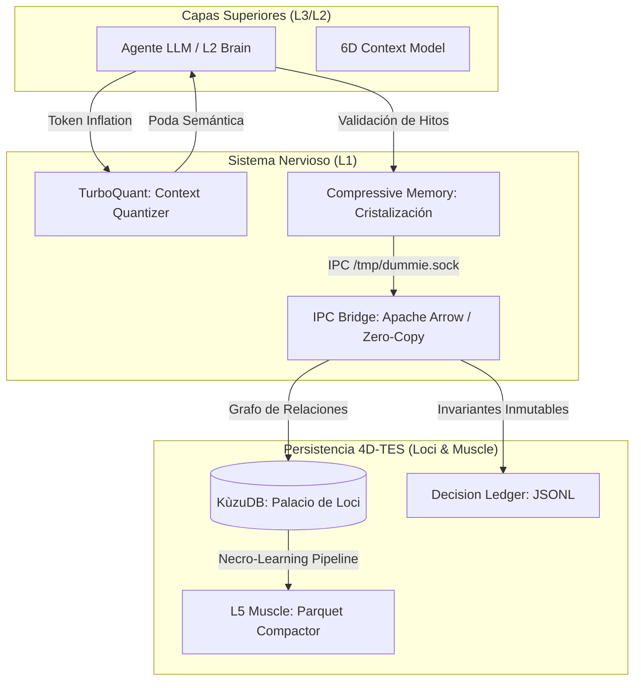

# Motor de Memoria Inmutable (4D-TES)

## Purpose
Definir el contrato operativo del motor de memoria espacio-temporal de DUMMIE Engine. El 4D-TES (Temporal-Evolutionary Storage) garantiza que el conocimiento del sistema sea inmutable, rastreable y eficiente mediante técnicas de compresión semántica y persistencia en grafos.

## Arquitectura Técnica

### 1. Dimensiones del Conocimiento (Spec 12)
El motor opera sobre un modelo de 6 dimensiones para indexar cada evento cognitivo:
- **Espacio (Locus X, Y, Z):** Coordenadas en la ontología del sistema (ej. `layers.l2_brain.logic`).
- **Tiempo (Lamport T):** Orden lógico determinista.
- **Autoridad (A):** Nivel de permiso del emisor (Human, Agent, Overseer).
- **Intención (I):** Propósito del cambio (Fabrication, Audit, Resolution).

### 2. Flujo de Datos y Cristalización


### 3. Componentes Críticos
- **TurboQuant:** Poda semántica del árbol de archivos y densificación de Markdown a YAML para optimizar el KV Cache.
- **Compressive Memory:** Algoritmo de extracción de hitos (Decisiones, Errores, Estado) que resume el historial.
- **Apache Arrow Bridge:** Plano de datos de baja latencia para el transporte de nodos de memoria entre procesos (Go/Python).
- **KùzuDB (Palacio de Loci):** Base de datos de grafos embebida que almacena la topología del conocimiento.

## Contract Invariants
- **Inmutabilidad:** Una vez que un nodo (`MemoryNode4DTES`) es persistido, su `causal_hash` no puede cambiar.
- **Causalidad:** Todo nodo (excepto GENESIS) debe tener un `parent_hash` válido.
- **Consistencia:** El estado del Loci Graph debe ser verificable mediante el `Decision Ledger`.

## Physical Evidence
- `layers/l1_nervous/compressive_memory.py`: Lógica de cristalización.
- `layers/l1_nervous/context_quantizer.py`: Implementación de TurboQuant.
- `layers/l1_nervous/main.go`: Orquestador de hashes causales.
- `layers/l2_brain/models.py`: Definición del SixDimensionalContext.
- `.aiwg/memory/loci.db`: Base de datos física de Kùzu.

## Verification
```bash
python3 scripts/validate_specs_docs.py --check doc/specs/02_memory_engine_4d_tes.md
```

## Traceability
| Invariant | Evidence | Verification |
| --- | --- | --- |
| Inmutabilidad Causal | `layers/l1_nervous/main.go` | SHA-256 Validation in tests |
| Poda Semántica | `layers/l1_nervous/context_quantizer.py` | TurboQuant Benchmarks |
| Persistencia Loci | `.aiwg/memory/loci.db` | Kùzu Cypher Queries |
