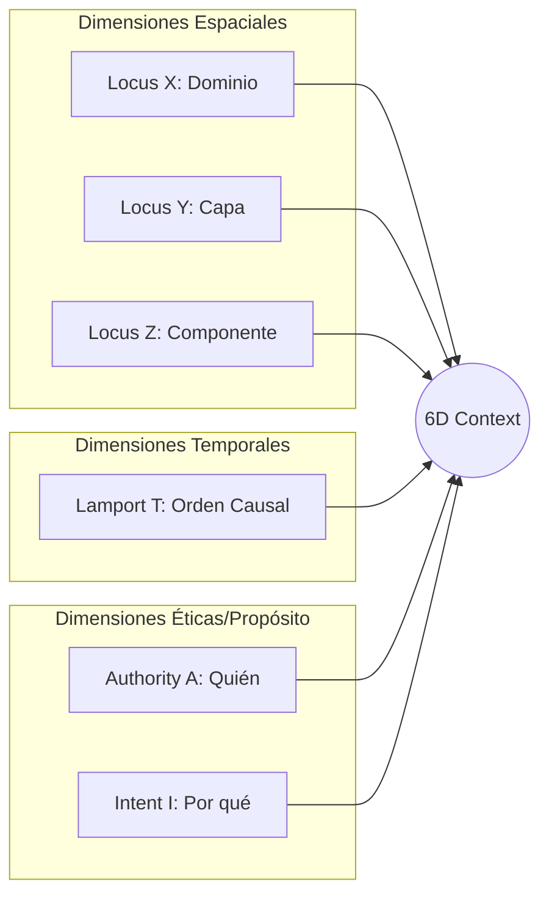

# Modelo Formal de Memoria 6D-Context

## Purpose
Establecer el sistema de coordenadas de 6 dimensiones utilizado por DUMMIE Engine para indexar, navegar y recuperar información del 4D-TES. Este modelo asegura que cada interacción sea situada en un contexto espacial, temporal, de autoridad e intención.

## Current State
El contrato 6D está implementado en `MemoryNode4D`, en los tipos de contexto de L2 y en el contrato protobuf compartido. La forma exacta de los nombres sigue teniendo puentes legacy, pero el sistema ya usa `locus_x`, `locus_y`, `locus_z`, `lamport_t`, `authority_a` e `intent_i` como base causal.

## Definición de Dimensiones

### Plano Espacial (Locus X, Y, Z)
- **Locus X (Dominio/Módulo):** Identifica el área funcional (ej. `brain`, `nervous`, `muscle`).
- **Locus Y (Capa Arquitectónica):** Identifica el nivel en la arquitectura hexagonal (ej. `domain`, `application`, `infrastructure`).
- **Locus Z (Componente Físico):** Identifica el artefacto o archivo concreto (ej. `models.py`, `main.go`).

### Plano Temporal (Lamport T)
- **Lamport T:** Reloj lógico de Lamport que garantiza el orden causal de los eventos. Permite resolver conflictos en sistemas distribuidos y reconstruir la línea de tiempo de decisiones.

### Plano Ético y de Propósito (Authority A, Intent I)
- **Authority A (Quién):** Nivel de privilegios y origen (ej. `HUMAN`, `AGENT`, `OVERSEER`).
- **Intent I (Por qué):** La categoría semántica de la acción (ej. `FABRICATION` para código, `AUDIT` para validación, `RESOLUTION` para ambigüedades).

## Visualización del Modelo


## Contract Invariants
- **Atomicidad:** Un contexto 6D debe estar presente en cada nodo de memoria creado.
- **Trazabilidad:** La dimensión `Authority A` debe coincidir con los permisos del agente ejecutor.
- **Determinismo:** El valor de `Lamport T` debe ser monótonamente creciente dentro de una misma rama causal.

## Physical Evidence
- `layers/l2_brain/models.py`: Implementación de SixDimensionalContext y del nodo canónico MemoryNode4D.
- `layers/l1_nervous/main.go`: Generación de contextos para eventos del sistema nervioso.
- `proto/dummie/v2/core.proto`: Definición del contrato binario del contexto.

## Verification
```bash
python3 scripts/validate_specs_docs.py --check doc/specs/12_6d_context_model.md
cd layers/l2_brain && PYTHONPATH=../.. uv run pytest -q tests/test_domain_models.py tests/test_causal_integrity.py
```

## Traceability
| Invariant | Evidence | Verification |
| --- | --- | --- |
| Estructura 6D | `layers/l2_brain/models.py` | Unit tests en `tests/test_domain_models.py` |
| Reloj Lamport | `layers/l1_nervous/main.go` | Causal integrity tests |
| Autoridad Validada | `layers/l3_shield` | RBAC Policy checks |
