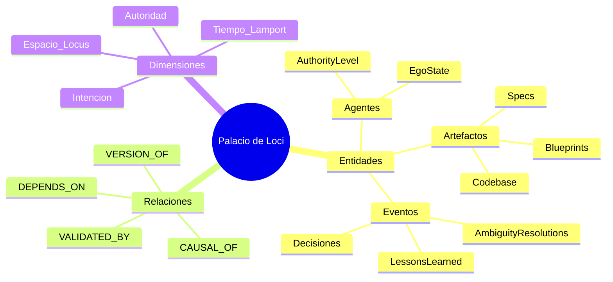

# Palacio de Loci y RBAC Topográfico

## Purpose
Definir la estructura ontológica y el sistema de control de acceso basado en topología (RBAC Topográfico) de DUMMIE Engine. El Palacio de Loci es el grafo de conocimiento que organiza todas las entidades, relaciones y eventos del sistema de forma espacial y navegable.

## Current State
La ontología operativa actual usa Kùzu como backing store del 4D-TES y expone rutas de consulta y recuperación causal desde L2. El RBAC topográfico todavía convive con capas de policy en L3, pero el modelo espacial y las rutas de evidencia ya existen físicamente.

## Estructura Ontológica (Palacio de Loci)

El sistema utiliza **KùzuDB** para almacenar un grafo denso donde la ubicación (Locus) determina la relevancia y el acceso.

### Mapa Mental del Palacio


### Nodos y Relaciones Críticas
- **Nodos de Memoria (MemoryNode4DTES):** La unidad básica de conocimiento inmutable.
- **Relación `CAUSAL_OF`:** Une nodos en una cadena de hashes, permitiendo el `Recovery` ante fallos.
- **Relación `DEPENDS_ON`:** Vincula requisitos (Specs) con implementaciones (Código).

## RBAC Topográfico (Control de Acceso)
El acceso a la información no se define solo por "roles", sino por la **posición en el Loci**.
- Un agente operando en `layers.l5_muscle` tiene permisos heredados sobre ese locus espacial.
- El acceso a `layers.l0_overseer` está restringido a niveles de autoridad `OVERSEER` o `HUMAN`.

## Contract Invariants
- **Integridad Topológica:** No pueden existir nodos huérfanos sin una ubicación en el Locus X/Y/Z.
- **Soberanía de Datos:** Cada Locus X (Dominio) es el dueño de sus datos; otros dominios deben usar el Loci Graph para consultas de sólo lectura.

## Physical Evidence
- `.aiwg/memory/kuzu/state.db`: Base local runtime de Kùzu cuando existe en el entorno de desarrollo.
- `layers/l1_nervous/tools_impl/core.py`: Herramientas de calibración del Loci Graph.
- `layers/l2_brain/implementation_plan.md`: Plan de migración a la ontología Loci.

## Verification
```bash
python3 scripts/validate_specs_docs.py --check doc/specs/18_loci_ontology_mapping.md
cd layers/l2_brain && PYTHONPATH=../.. uv run pytest -q tests/test_causal_integrity_suite.py
```

## Traceability
| Invariant | Evidence | Verification |
| --- | --- | --- |
| Grafo de Relaciones | `layers/l2_brain/adapters.py` | Repository tests and Kùzu query smoke checks |
| RBAC Topográfico | `layers/l3_shield` | Policy enforcement tests |
| Mapeo Ontológico | `doc/specs/18_loci_ontology_mapping.feature` | Gherkin acceptance tests |
