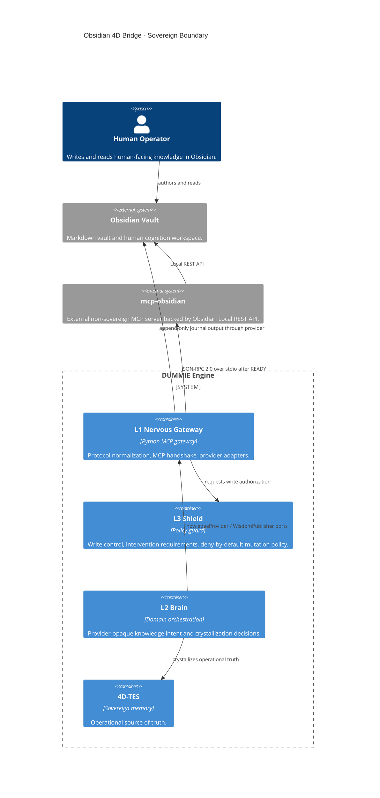

# Obsidian 4D Bridge Design

## ADR

**ID:** 2026-04-26-OBS-001
**Status:** APPROVED-FOR-SPECIFICATION
**Role:** Principal Systems Engineer / Sovereign Architect
**Date:** 2026-04-26

## Purpose

Integrate `MarkusPfundstein/mcp-obsidian` as an external, non-sovereign knowledge provider for DUMMIE Engine without contaminating L2 domain logic, weakening 4D-TES authority, or exposing generic vault mutation to agent execution.

Obsidian is a human-facing knowledge surface. The 4D-TES remains the operational source of truth.

## External Source Boundary

The external repository provides a Python MCP server that communicates with Obsidian through the Obsidian Local REST API community plugin. It is not imported into DUMMIE as domain code.

Allowed external tool names are limited to the tools observed in `mcp-obsidian`:

- `obsidian_list_files_in_vault`
- `obsidian_list_files_in_dir`
- `obsidian_get_file_contents`
- `obsidian_simple_search`
- `obsidian_append_content`
- `obsidian_patch_content`
- `obsidian_put_content`
- `obsidian_delete_file`
- `obsidian_complex_search`
- `obsidian_batch_get_file_contents`
- `obsidian_get_periodic_note`
- `obsidian_get_recent_periodic_notes`
- `obsidian_get_recent_changes`

No other Obsidian tools are assumed by this design.

## Invariants

### I1: Provider Opacity

L2 has no dependency on Obsidian names, paths, environment variables, tool names, or REST semantics. L2 interacts only with agnostic knowledge ports.

### I2: One-Way Operational Truth

Obsidian may provide context input and receive curated wisdom output. It must not become a peer source of operational truth. Once a note is crystallized, the 4D-TES copy is the truth used for execution.

Raw bidirectional file synchronization is prohibited.

### I3: Deterministic MCP Handshake

No `tools/call` request may be sent to `mcp-obsidian` until the proxy connection is in `READY`.

### I4: Controlled Write Surface

Generic write tools from `mcp-obsidian` are never exposed directly to L2. All writes pass through DUMMIE-owned wrappers and L3 policy.

## Architecture

```text
Obsidian Vault
  ^  |
  |  v
Obsidian Local REST API plugin
  ^  |
  |  v
mcp-obsidian
  ^  |
  |  v
L1 MCPProxyManager
  ^  |
  |  v
L1 ObsidianKnowledgeAdapter
  ^  |
  |  v
L2 KnowledgeService port
  ^  |
  |  v
4D-TES
```

L1 owns protocol, process, environment, handshake, and provider-specific tool translation.

L2 owns intent, knowledge use cases, crystallization decisions, and domain-level conflict policy.

L3 owns write authorization and human intervention requirements.

## C4/Mermaid Mental Model



This diagram is a reasoning artifact. Implementation must still follow the concrete file-level plan produced after this design.

## Hexagonal Mapping

| Domain Port | Owning Layer | Adapter | External Tool Dependency |
| --- | --- | --- | --- |
| `KnowledgeProvider.search_context` | L2 | `ObsidianKnowledgeAdapter.search_context` in L1 | `obsidian_simple_search`, optional `obsidian_complex_search` |
| `KnowledgeProvider.get_artifact` | L2 | `ObsidianKnowledgeAdapter.get_artifact` in L1 | `obsidian_get_file_contents` |
| `KnowledgeProvider.ingest_artifact` | L2 use case, L1 adapter | `obsidian_ingest_note` wrapper | `obsidian_get_file_contents` |
| `WisdomPublisher.export_decision_summary` | L2 intent, L3 gate, L1 adapter | `obsidian_export_decision_summary` wrapper | `obsidian_append_content` only |
| `WisdomPublisher.export_lesson` | L2 intent, L3 gate, L1 adapter | `obsidian_export_lesson` wrapper | `obsidian_append_content` only |
| `WisdomPublisher.export_session_summary` | L2 intent, L3 gate, L1 adapter | `obsidian_export_session_summary` wrapper | `obsidian_append_content` only |

L2 must not call `exec_remote_tool("obsidian", "...")` directly.

## Metacognitive Operating Model

This integration changes how agents reason about knowledge. It must therefore define agent cognition, not only transport wiring.

### Cognitive Roles

| Role | Question It Answers | Forbidden Shortcut |
| --- | --- | --- |
| Provider Adapter | "Can I retrieve or publish through this external system?" | Treating provider output as truth. |
| Knowledge Service | "What domain-level knowledge operation is being requested?" | Naming Obsidian or tool-specific calls. |
| Crystallizer | "Should this artifact become sovereign memory?" | Copying raw Markdown without provenance. |
| Shield | "Is this mutation safe, scoped, and reversible?" | Allowing generic overwrite/delete from L2. |
| Journal Exporter | "What does the human need to understand?" | Exporting dense TES internals without explanation. |

### Reflection Loop

Every Obsidian operation must pass this mental checklist before execution:

1. **Provider opacity:** Can the same L2 intent work with a different knowledge provider?
2. **Truth direction:** Is this input to 4D-TES or output from 4D-TES?
3. **Authority:** What authority level is assigned to the resulting memory or journal entry?
4. **Causality:** Which Lamport event and source hash explain this operation?
5. **Mutation risk:** Is this read-only, append-only, or destructive?
6. **Human readability:** If exported, does the output explain the decision rather than leak raw internals?

If any answer is unknown, the operation fails closed and records an ambiguity.

### Uncertainty Budget

The agent must distinguish three uncertainty classes:

- **Protocol uncertainty:** MCP state, handshake, missing tool, child process health. Resolution belongs in L1.
- **Semantic uncertainty:** Whether a note means the same thing as an existing memory. Resolution belongs in L2 conflict logic.
- **Authority uncertainty:** Whether external human-authored text supersedes prior engine memory. Resolution belongs in L3/L2 review, not automatic overwrite.

### Decision Promotion Ladder

```text
Observed text
  -> SourceArtifact
  -> CandidateMemory
  -> ConflictCheck
  -> CrystallizedMemory | AmbiguityRecord
  -> OptionalHumanJournal
```

Agents must not jump from `Observed text` directly to operational execution.

### Anti-Entropy Rules

- Prefer small wrapper outputs over raw provider payloads.
- Preserve source path and payload hash on every ingestion.
- Truncate search output before it reaches L2 planning loops.
- Export summaries to Obsidian, not full internal state dumps.
- Treat missing provenance as a failed ingestion.

## Staff+ Expansion: Universal Knowledge Bus

The Obsidian bridge is the first adapter for a broader pattern: a Universal Knowledge Bus for sovereign AI systems. The bus separates external knowledge surfaces from operational truth while giving the engine mechanisms for entropy control, pre-flight validation, swarm transparency, and disaster recovery.

The core abstraction is:

```text
External Knowledge Surface
  -> KnowledgeProviderAdapter
  -> SourceArtifact
  -> KnowledgeService Port
  -> 4D-TES
  -> WisdomPublisher Port
  -> Human-Readable Mirror
```

Obsidian is one monitor on this bus, not the bus itself.

### Pillar 11: Semantic Entropy Management

Problem: a Lamport-ordered 4D-TES can accumulate noise faster than agents can use it. Every memory may be causally valid, but not every memory deserves hot retrieval priority.

Design:

- Use human relevance signals from Obsidian as one input to memory temperature.
- Signals include recent edits, repeated reads, explicit tags, curated decision notes, and manual correction notes.
- The 4D-TES remains append-only; entropy management changes retrieval priority and storage tier, not historical truth.

Memory temperature classes:

| Class | Meaning | Behavior |
| --- | --- | --- |
| `HOT` | Human-relevant, recent, frequently used, or decision-critical | Prefer in context hydration and KV-cache preloading. |
| `WARM` | Valid but not immediately active | Retrieve by semantic match or explicit locus. |
| `COLD` | Valid but low human relevance or superseded | Keep in durable storage; exclude from default context. |
| `QUARANTINED` | Conflicting, low confidence, or unresolved | Require review before operational use. |

Entropy control must never delete sovereign memory automatically. It may compact, demote, summarize, or quarantine.

### Pillar 12: Pre-Flight Validation Sandbox

Problem: complex tasks can fail because the model commits to a plan before human correction.

Design:

- Before high-risk implementation, the engine can publish a draft intention to an append-only or draft note.
- The human may edit or comment on that draft in Obsidian.
- The engine re-ingests the corrected artifact before modifying code.

Draft lifecycle:

```text
IntentDraft
  -> Obsidian simulation note
  -> Human correction
  -> Re-ingested SourceArtifact
  -> PlanUpdate
  -> ExecutionApproval
```

This is a pre-execution sandbox. It must not mutate repo files or 4D-TES operational truth until the corrected draft is crystallized or explicitly approved.

### Pillar 13: Swarm Consensus Mirroring

Problem: multi-agent systems can become opaque. A human needs a navigable representation of what agents considered, rejected, and agreed on.

Design:

- Each agent may emit scoped thought artifacts into a controlled mirror namespace.
- Consensus is promoted only through a structured `ConsensusDecision` artifact.
- Obsidian receives readable summaries, not unrestricted chain-of-thought dumps or raw provider transcripts.

Consensus promotion:

```text
AgentObservation[]
  -> EvidencePacket[]
  -> ConsensusDraft
  -> L3 review
  -> ConsensusDecision
  -> 4D-TES crystallization
  -> Obsidian consensus mirror
```

Consensus mirrors are explainability artifacts. The 4D-TES decision record remains the authoritative object.

### Pillar 14: Deep Memory Rehydration

Problem: the physical 4D-TES store can be corrupted, lost, or made temporarily unavailable.

Design:

- Obsidian journal exports form a human-readable black-box recorder.
- The engine can bootstrap a reduced cognitive state by scanning curated notes.
- Rehydration reconstructs decisions, lessons, source provenance, authority markers, and open questions.

Rehydration classes:

| Artifact | Rehydration Role |
| --- | --- |
| Decision notes | Rebuild approved decision records and rationale. |
| Lesson notes | Rebuild issue/correction memory. |
| Session summaries | Rebuild work continuity and open questions. |
| Consensus notes | Rebuild swarm-level architectural decisions. |
| Source provenance blocks | Reconnect Obsidian artifacts to 4D-TES hashes when available. |

Rehydration is conservative: it restores a usable cognitive baseline, not a byte-perfect database snapshot.

## Universal Knowledge Bus Contracts

The bus requires provider-agnostic records. These contracts become the mental model for future providers beyond Obsidian.

### `SourceArtifact`

```json
{
  "$id": "dummie.source_artifact.v1",
  "type": "object",
  "additionalProperties": false,
  "properties": {
    "provider": { "type": "string", "minLength": 1 },
    "source_uri": { "type": "string", "minLength": 1 },
    "content_type": { "type": "string", "enum": ["text/markdown", "text/plain", "application/json"] },
    "content": { "type": "string" },
    "payload_hash": { "type": "string", "minLength": 16 },
    "observed_at": { "type": "string", "format": "date-time" },
    "metadata": { "type": "object" }
  },
  "required": ["provider", "source_uri", "content_type", "content", "payload_hash", "observed_at"]
}
```

### `MemoryTemperatureSignal`

```json
{
  "$id": "dummie.memory_temperature_signal.v1",
  "type": "object",
  "additionalProperties": false,
  "properties": {
    "source_uri": { "type": "string", "minLength": 1 },
    "provider": { "type": "string", "minLength": 1 },
    "signal_type": {
      "type": "string",
      "enum": ["human_edit", "human_read", "manual_pin", "decision_reference", "superseded", "conflict"]
    },
    "weight": { "type": "number", "minimum": -1.0, "maximum": 1.0 },
    "observed_at": { "type": "string", "format": "date-time" }
  },
  "required": ["source_uri", "provider", "signal_type", "weight", "observed_at"]
}
```

### `IntentDraft`

```json
{
  "$id": "dummie.intent_draft.v1",
  "type": "object",
  "additionalProperties": false,
  "properties": {
    "draft_id": { "type": "string", "minLength": 1 },
    "goal": { "type": "string", "minLength": 1 },
    "risk_level": { "type": "string", "enum": ["low", "medium", "high"] },
    "proposed_steps": {
      "type": "array",
      "items": { "type": "string" },
      "minItems": 1
    },
    "requires_human_review": { "type": "boolean" },
    "target_file": { "type": "string", "minLength": 1 }
  },
  "required": ["draft_id", "goal", "risk_level", "proposed_steps", "requires_human_review", "target_file"]
}
```

### `ConsensusDecision`

```json
{
  "$id": "dummie.consensus_decision.v1",
  "type": "object",
  "additionalProperties": false,
  "properties": {
    "consensus_id": { "type": "string", "minLength": 1 },
    "topic": { "type": "string", "minLength": 1 },
    "participants": {
      "type": "array",
      "items": { "type": "string" },
      "minItems": 1
    },
    "decision": { "type": "string", "minLength": 1 },
    "dissent": {
      "type": "array",
      "items": { "type": "string" },
      "default": []
    },
    "evidence_refs": {
      "type": "array",
      "items": { "type": "string" },
      "default": []
    }
  },
  "required": ["consensus_id", "topic", "participants", "decision"]
}
```

### `RehydrationManifest`

```json
{
  "$id": "dummie.rehydration_manifest.v1",
  "type": "object",
  "additionalProperties": false,
  "properties": {
    "manifest_id": { "type": "string", "minLength": 1 },
    "source_provider": { "type": "string", "minLength": 1 },
    "scan_roots": {
      "type": "array",
      "items": { "type": "string" },
      "minItems": 1
    },
    "artifact_kinds": {
      "type": "array",
      "items": {
        "type": "string",
        "enum": ["decision", "lesson", "session_summary", "consensus", "open_question"]
      },
      "minItems": 1
    },
    "mode": { "type": "string", "enum": ["dry_run", "restore_baseline"] }
  },
  "required": ["manifest_id", "source_provider", "scan_roots", "artifact_kinds", "mode"]
}
```

## Data Flow

### Input: Hydrate Context

```text
Obsidian Markdown
  -> obsidian_get_file_contents
  -> ObsidianKnowledgeAdapter
  -> SourceArtifact
  -> obsidian_ingest_note
  -> crystallize
  -> 4D-TES node
```

The adapter maps:

- note path to `locus_x` or equivalent artifact coordinate,
- provider id to source metadata,
- ingestion time to Lamport event,
- note content to payload,
- human-authored source to `authority_a = HUMAN`,
- operation to `intent_i = KNOWLEDGE_INGESTION` or the closest existing internal intent.

### Output: Curated Wisdom Journal

```text
L2 decision / lesson / session summary
  -> L3 policy guard
  -> append-only journal wrapper
  -> obsidian_append_content
  -> Obsidian Markdown journal
```

Obsidian output exists for human explainability, not engine execution.

## MCP Proxy State Machine

`MCPProxyManager` must maintain per-server connection state.

```text
INIT
  -> WAIT_SERVER
  -> HANDSHAKE_OK
  -> DISCOVERY
  -> READY
  -> DEGRADED | FAILED
```

### INIT

Start child process and send JSON-RPC `initialize`.

Required client payload:

```json
{
  "jsonrpc": "2.0",
  "id": "init-<server>-<nonce>",
  "method": "initialize",
  "params": {
    "protocolVersion": "2024-11-05",
    "capabilities": {},
    "clientInfo": {
      "name": "dummie-mcp-proxy",
      "version": "0.1.0"
    }
  }
}
```

### WAIT_SERVER

Read and validate the server response. The response must include a `result` object. Server capabilities are recorded but do not automatically grant execution permission.

### HANDSHAKE_OK

Send JSON-RPC notification:

```json
{
  "jsonrpc": "2.0",
  "method": "notifications/initialized"
}
```

### DISCOVERY

Call `tools/list`, cache tool schemas, and apply DUMMIE allow/deny policy.

### READY

Only now may the proxy send `tools/call`.

### DEGRADED

Read-only operations may continue only if discovery succeeded and the child process remains healthy. Writes are blocked.

### FAILED

No operations are allowed. The gateway returns a diagnostic error.

## Sovereign Wrapper Schemas

Schemas are normative JSON Schema contracts for DUMMIE-owned wrappers.

### `obsidian_search_context`

```json
{
  "$id": "dummie.obsidian_search_context.input.v1",
  "type": "object",
  "additionalProperties": false,
  "properties": {
    "query": { "type": "string", "minLength": 1 },
    "mode": { "type": "string", "enum": ["simple", "complex"], "default": "simple" },
    "context_length": { "type": "integer", "minimum": 20, "maximum": 1000, "default": 200 },
    "limit": { "type": "integer", "minimum": 1, "maximum": 50, "default": 10 }
  },
  "required": ["query"]
}
```

Output:

```json
{
  "$id": "dummie.knowledge_search_result.v1",
  "type": "object",
  "additionalProperties": false,
  "properties": {
    "provider": { "const": "obsidian" },
    "results": {
      "type": "array",
      "items": {
        "type": "object",
        "additionalProperties": false,
        "properties": {
          "path": { "type": "string" },
          "score": { "type": "number" },
          "excerpt": { "type": "string" }
        },
        "required": ["path", "excerpt"]
      }
    }
  },
  "required": ["provider", "results"]
}
```

### `obsidian_ingest_note`

```json
{
  "$id": "dummie.obsidian_ingest_note.input.v1",
  "type": "object",
  "additionalProperties": false,
  "properties": {
    "filepath": { "type": "string", "minLength": 1 },
    "ingest_reason": { "type": "string", "minLength": 1 },
    "locus_hint": { "type": "string" },
    "tags": {
      "type": "array",
      "items": { "type": "string" },
      "default": []
    }
  },
  "required": ["filepath", "ingest_reason"]
}
```

Output:

```json
{
  "$id": "dummie.obsidian_ingest_note.output.v1",
  "type": "object",
  "additionalProperties": false,
  "properties": {
    "provider": { "const": "obsidian" },
    "source_path": { "type": "string" },
    "tes_node_id": { "type": "string" },
    "lamport_t": { "type": "number" },
    "authority_a": { "type": "string" },
    "payload_hash": { "type": "string" },
    "conflict_status": {
      "type": "string",
      "enum": ["none", "shadowed_prior_memory", "requires_review"]
    }
  },
  "required": ["provider", "source_path", "tes_node_id", "lamport_t", "authority_a", "payload_hash", "conflict_status"]
}
```

### `obsidian_append_journal_entry`

```json
{
  "$id": "dummie.obsidian_append_journal_entry.input.v1",
  "type": "object",
  "additionalProperties": false,
  "properties": {
    "filepath": { "type": "string", "minLength": 1 },
    "journal_type": { "type": "string", "enum": ["journal", "decisions", "lessons", "session_summary"] },
    "title": { "type": "string", "minLength": 1 },
    "content": { "type": "string", "minLength": 1 },
    "source_event_id": { "type": "string" }
  },
  "required": ["filepath", "journal_type", "title", "content"]
}
```

Output:

```json
{
  "$id": "dummie.obsidian_append_journal_entry.output.v1",
  "type": "object",
  "additionalProperties": false,
  "properties": {
    "provider": { "const": "obsidian" },
    "source_event_id": { "type": "string" },
    "filepath": { "type": "string" },
    "operation": { "const": "append" },
    "policy": { "const": "L3_AUTO_APPEND" }
  },
  "required": ["provider", "filepath", "operation", "policy"]
}
```

### `obsidian_export_decision_summary`

```json
{
  "$id": "dummie.obsidian_export_decision_summary.input.v1",
  "type": "object",
  "additionalProperties": false,
  "properties": {
    "decision_id": { "type": "string", "minLength": 1 },
    "summary": { "type": "string", "minLength": 1 },
    "rationale": { "type": "string", "minLength": 1 },
    "evidence_refs": {
      "type": "array",
      "items": { "type": "string" },
      "default": []
    },
    "target_file": { "type": "string", "minLength": 1 }
  },
  "required": ["decision_id", "summary", "rationale", "target_file"]
}
```

This wrapper delegates to `obsidian_append_journal_entry` after L3 policy approval.

### `obsidian_export_lesson`

```json
{
  "$id": "dummie.obsidian_export_lesson.input.v1",
  "type": "object",
  "additionalProperties": false,
  "properties": {
    "lesson_id": { "type": "string", "minLength": 1 },
    "issue": { "type": "string", "minLength": 1 },
    "correction": { "type": "string", "minLength": 1 },
    "target_file": { "type": "string", "minLength": 1 }
  },
  "required": ["lesson_id", "issue", "correction", "target_file"]
}
```

This wrapper delegates to `obsidian_append_journal_entry` after L3 policy approval.

### `obsidian_export_session_summary`

```json
{
  "$id": "dummie.obsidian_export_session_summary.input.v1",
  "type": "object",
  "additionalProperties": false,
  "properties": {
    "session_id": { "type": "string", "minLength": 1 },
    "summary": { "type": "string", "minLength": 1 },
    "decisions": {
      "type": "array",
      "items": { "type": "string" },
      "default": []
    },
    "open_questions": {
      "type": "array",
      "items": { "type": "string" },
      "default": []
    },
    "target_file": { "type": "string", "minLength": 1 }
  },
  "required": ["session_id", "summary", "target_file"]
}
```

This wrapper delegates to `obsidian_append_journal_entry` after L3 policy approval.

## L3 Write Policy

| Operation | External Tool | Policy | Rule |
| --- | --- | --- | --- |
| Read file | `obsidian_get_file_contents` | Allowed | Read-only. |
| Search | `obsidian_simple_search`, `obsidian_complex_search` | Allowed | Output truncated by gateway context budget. |
| Batch read | `obsidian_batch_get_file_contents` | Allowed | Gateway output limits apply. |
| Recent changes | `obsidian_get_recent_changes` | Allowed | Read-only. |
| Periodic reads | `obsidian_get_periodic_note`, `obsidian_get_recent_periodic_notes` | Allowed | Read-only. |
| Append journal | `obsidian_append_content` | `L3_AUTO_APPEND` | Only DUMMIE wrappers may call this. Target must be append-only journal path or policy-approved decision/lesson file. |
| Patch | `obsidian_patch_content` | `L3_INTERVENTION_REQUIRED` | Requires `yield_and_notify` before execution. |
| Put/overwrite | `obsidian_put_content` | `L3_INTERVENTION_REQUIRED` | Requires `yield_and_notify` before execution. |
| Delete | `obsidian_delete_file` | `L3_INTERVENTION_REQUIRED` | Requires `yield_and_notify`; default deny. |

Append-only output should include a machine-readable provenance block:

```markdown
---
dummie_event_id: "<event-id>"
dummie_lamport_t: <lamport>
dummie_export_type: "decision|lesson|session_summary|journal"
dummie_truth_source: "4D-TES"
---
```

## Conflict Resolution

Conflict resolution occurs during `obsidian_ingest_note`.

### Conflict Inputs

- `source_path`
- `payload_hash`
- normalized content hash
- source modified time if available through provider output
- current Lamport clock
- nearest 4D-TES memories by locus and semantic affinity

### Rules

1. If no related 4D-TES memory exists, create a new node.
2. If related memory exists with the same payload hash, do not create a duplicate. Return the existing node id.
3. If related memory exists with different payload hash and lower authority than `HUMAN`, create a new node that shadows the prior memory.
4. If related memory exists with different payload hash and equal or higher authority, create an ambiguity record and return `requires_review`.
5. If the Obsidian note claims to supersede an internal decision but lacks an explicit decision reference, create an ambiguity record and do not replace operational truth.

Lamport order records ingestion causality; it does not by itself override authority.

## Configuration

Initial registry entry must be disabled until handshake conformance is verified:

```json
{
  "mcpServers": {
    "obsidian": {
      "command": "uvx",
      "args": ["mcp-obsidian"],
      "env": {
        "OBSIDIAN_API_KEY": "<secret>",
        "OBSIDIAN_HOST": "127.0.0.1",
        "OBSIDIAN_PORT": "27124"
      },
      "disabled": true
    }
  }
}
```

Secrets must not be committed to the repository.

## Failure Modes

### Obsidian Process Unavailable

The adapter returns a provider-unavailable error. L2 may continue using existing 4D-TES memory.

### Handshake Failure

The proxy marks the server `FAILED`. No tool calls are allowed.

### Tool Not Discovered

The wrapper fails closed. The implementation must not guess alternate tool names.

### Write Policy Denied

The wrapper returns `L3_INTERVENTION_REQUIRED` and, where appropriate, uses `yield_and_notify`.

### Oversized Note

The adapter chunks or rejects ingestion according to context budget. Partial ingestion must be marked as partial in metadata.

## Testing Requirements

1. Unit test MCP state transitions: no `tools/call` before `READY`.
2. Unit test discovery allowlist: unknown tools are ignored.
3. Unit test L2 opacity: L2 tests must not reference `obsidian`.
4. Unit test wrapper schemas: invalid inputs are rejected.
5. Unit test L3 policy: append allowed only through wrapper; patch/put/delete require intervention.
6. Integration smoke with a fake MCP Obsidian server implementing `initialize`, `notifications/initialized`, `tools/list`, and `tools/call`.
7. Conflict tests for duplicate, shadow, and ambiguity cases.

## Non-Goals

- Do not vendor `mcp-obsidian` into DUMMIE source.
- Do not make Obsidian a database for the engine.
- Do not expose generic Obsidian write tools to L2.
- Do not implement raw two-way synchronization.
- Do not assume tools beyond the observed `mcp-obsidian` tool list.

## Acceptance Criteria

- `mcp-obsidian` can be registered as a disabled external MCP server.
- The proxy has a deterministic READY state before any tool call.
- L2 can request knowledge operations without naming Obsidian.
- Read-only Obsidian tools can be accessed through L1 wrappers.
- Journal export uses append-only wrappers and L3 policy.
- Patch, overwrite, and delete are denied unless L3 intervention and human yield are satisfied.
- Ingested notes become 4D-TES memories with source provenance and conflict status.
