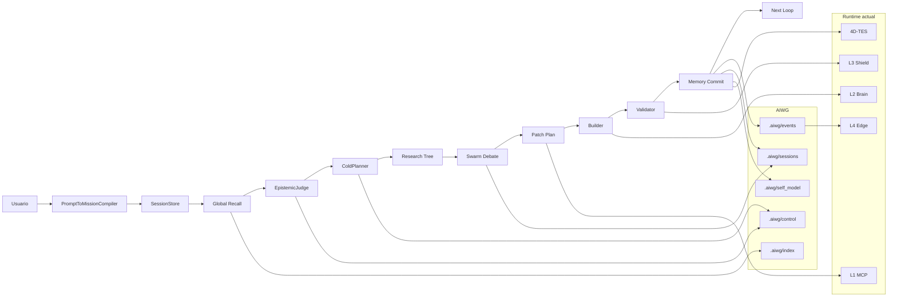
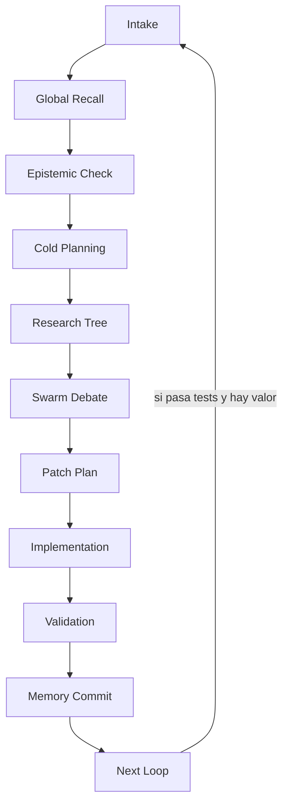

# Plan maestro para convertir DUMMIE Engine en un sistema cognitivo autoevolutivo

## Resumen ejecutivo

El estado visible del repo en entity["company","GitHub","developer platform"] muestra que DUMMIE Engine ya no es “solo una idea”: hoy es un monorepo multi‑capa L0–L6 con gateway MCP en `layers/l1_nervous`, núcleo cognitivo en `layers/l2_brain`, validadores L3/L4/L5 presentes, comandos de verificación explícitos en el README, un índice maestro documental en `doc/CORE_SPEC.md`, un mapa físico verificado en `doc/PHYSICAL_MAP.md`, un workflow agéntico mínimo en `doc/agentic/*`, y una especificación de razonamiento local en modo sombra en `doc/specs/44_local_reasoning_gateway.md`. Además, el repo ya contiene huellas de personalidad y colaboración (`GEMINI.md`, `IDENTITY.md`, `SOUL.md`, `AGENTS.md`) y carpetas relacionadas con agentes y OpenClaw (`.agents`, `.clawhub`, `.openclaw`). Eso significa que el trabajo correcto no es “reinventar DUMMIE”, sino **conectar, endurecer y operacionalizar** lo que ya existe. citeturn30view0turn3view0turn6view0turn5view3turn5view2turn5view1turn27view2turn26view0turn29view0

La brecha principal no es ausencia de tooling; es ausencia de una **capa de cognición operacional** que una inventario global, memoria estructurada `.aiwg`, eventos de archivos, razonamiento secuencial externo, minería de patrones, sesiones largas, loop controlado y evolución de persona. Hoy DUMMIE ya puede hacer componentes de ese flujo: el daemon ejecuta un preflight cognitivo con `local.semantic_recall → local.reasoned_rerank → local.context_shaper`, el orquestador ya persiste nodos 4D/6D con Lamport time y authority/intent, y el servicio de local reasoning ya soporta proveedor local tipo Gemma/Ollama, proveedor OpenAI‑compatible y fallback determinista. Pero el watcher L4 aún está deshabilitado, el contexto global del repo no está indexado de forma legible para agentes, y no hay un SessionStore / PromptToMissionCompiler / PatternMiner que convierta una orden en una misión larga autocontenida. citeturn12view5turn9view0turn12view0turn12view1turn31view1turn12view6turn6view0

El camino recomendado es este: **primero seguridad y gobernanza; después índice global y memoria local; luego watcher y artefactos de reasoning; después EpistemicJudge, ColdPlanner, PatternMiner, SessionStore y SelfWorktreeOrchestrator; finalmente benchmark ORBIT-lite, exposición MCP y orquestación de negocio**. Esa secuencia respeta la verdad actual del repo, la política documental existente, el modo sombra del reasoning local y las mejores prácticas de permisos/artifacts de Antigravity y Gemini CLI. Las docs de Antigravity enfatizan Agent Manager, autonomía configurable, review/approve de acciones, artifacts verificables y strict mode; las de Gemini CLI agregan trusted folders, permisos explícitos para mutadores, MCP, GEMINI.md jerárquico, plan mode, checkpointing, restore/rewind/resume y headless mode; y OpenClaw ofrece un patrón útil de sesiones con `sessions.json` + transcripciones JSONL como fuente de verdad del gateway. citeturn18search0turn14search0turn14search1turn14search11turn21search0turn21search4turn24search0turn24search2turn22search2turn23search8turn25view0turn25view3

### Checklist priorizado

| Prioridad | Acción | Resultado mínimo |
|---|---|---|
| Inmediata | Congelar modo seguro de trabajo | No pushes, no merges, no deletes, no `.env`, no `.git` |
| Inmediata | Separar `.aiwg` versionable vs local | Protocolos en Git, índices/eventos/sesiones locales |
| Inmediata | Inventariar todo el repo | `repo_inventory.jsonl`, hashes, árbol base |
| Inmediata | Crear `file_cards` y `folder_cards` | Contexto global legible para agentes |
| Alta | Implementar watcher real | `FILE_ADDED`, `FILE_MODIFIED`, `FILE_DELETED`, `FILE_HASH_CHANGED` |
| Alta | Externalizar reasoning | intake → recall → epistemic → cold plan → research tree → debate → patch → validation |
| Alta | Añadir EpistemicJudge y ColdPlanner | Verdad antes de acción; prioridad antes de edición |
| Alta | Añadir PatternMiner y PersonaGuardian | Detección de reglas, hipótesis y alineación con el alma del repo |
| Alta | Añadir SessionStore | Sesiones largas, compactación, estado persistente |
| Alta | Añadir SelfWorktreeOrchestrator | Autoevolución controlada, plan‑only en MVP |
| Media | Añadir PromptToMissionCompiler | Prompt corto → misión larga estructurada |
| Media | Añadir ORBIT-lite | Medición objetiva de progreso cognitivo |
| Media | Exponer sesiones por MCP | Visibilidad/control desde L1 sin ejecución destructiva |
| Media | Añadir BusinessSolutionOrchestrator | De misión técnica a solución tecnológica de negocio |

La priorización se apoya en las fuentes de verdad ya declaradas por el propio repo —README, `CORE_SPEC`, `PHYSICAL_MAP`, `SWARM_WORKFLOW`, `EXECUTION_PROTOCOL` y spec 44— y en las superficies de control/permisos de Antigravity y Gemini CLI. citeturn30view0turn3view0turn6view0turn5view3turn5view2turn5view1turn14search0turn14search1turn17view8turn21search0

## Diagnóstico del estado actual

### Lo que ya existe y debe preservarse

El README público reporta que DUMMIE Engine es un sistema experimental de orquestación agéntica multi‑capa, con `layers/l0_overseer` a `layers/l6_skin`, gateway MCP operativo en Python, núcleo cognitivo actual en Python plano, validadores presentes en L3/L4/L5 y una verificación rápida basada en `git status --short`, smoke imports, `uv run pytest -q tests` en L2 y `python3 scripts/validate_specs_docs.py`. Esa misma página también muestra una estructura de repo amplia con `.agents`, `.clawhub`, `.openclaw`, `doc`, `docs`, `governance`, `layers`, `ledger`, `memory`, `scripts`, `skills`, `spec`, `tests`, además de archivos como `GEMINI.md`, `IDENTITY.md`, `SOUL.md`, `AGENTS.md`, `dummie_agent_config.json` y `dummie_gateway_config.json`. citeturn30view0turn30view0

`doc/CORE_SPEC.md` ya define un contrato documental fuerte: el archivo es índice maestro, no duplica implementación, las rutas listadas deben existir físicamente, solo admite estados `ACTIVE`, `DRAFT`, `PROPOSED`, `DEPRECATED`, y exige correr `python3 scripts/validate_specs_docs.py` cuando cambie una spec o su ubicación. En otras palabras: DUMMIE ya tiene noción de “truth maintenance” documental; solo falta extender esa disciplina a la memoria operacional `.aiwg`. citeturn3view0

`doc/PHYSICAL_MAP.md` aporta el diagnóstico arquitectónico más importante del repo. Ahí se confirma que L1 ya tiene Memory Plane tipado, gateway MCP estricto, zero‑copy IPC y Local Reasoning Gateway en modo sombra; que L2 tiene dominio/orquestación, adapters bridge, daemon con planner jerárquico y contratos para Gemma/Ollama/OpenAI‑compatible/fallback determinista; y que L4 tiene explícitamente el `file_watcher.py` deshabilitado hasta tener backend real. También enumera cuatro brechas prioritarias: drift de contratos entre L1/L2, falta de formalización de telemetría/resultados del daemon, specs aún genéricas y artefactos históricos fuera del contrato documental operativo. Eso marca con claridad qué hay que arreglar primero. citeturn6view0turn12view6

La capa de razonamiento local tampoco parte de cero. La spec 44 declara que el objetivo del Local Reasoning Gateway es usar un modelo local tipo Gemma como segunda etapa medible sobre embeddings, bus MCP y memoria 4D‑TES; su estado actual es modo sombra; y sus invariantes limitan el modelo local a recall, rerank, selección, compactación y feedback estructurado, dejando la ejecución de herramientas bajo daemon, SDD guards, runtime guards y L3 policy. El daemon actual ya implementa exactamente esa secuencia en `_run_cognitive_preflight`, llamando a `local.semantic_recall`, `local.reasoned_rerank` y `local.context_shaper`. En L2, `LocalReasoningService` ya materializa `reasoned_rerank` y `context_shaper`, y en L1 `tools_impl/local_reasoning.py` expone tanto `semantic_recall` como `reasoned_rerank`, `context_shaper` y `selection_feedback`, con persistencia de feedback en 4D‑TES usando contexto 6D (`locus_x/y/z`, `lamport_t`, `authority_a`, `intent_i`). citeturn5view1turn12view5turn12view0turn12view1turn31view1

La memoria causal ya existe como semilla fuerte. La spec 12 del modelo 6D declara que el contexto usa `locus_x`, `locus_y`, `locus_z`, `lamport_t`, `authority_a` e `intent_i`; y `CognitiveOrchestrator.process_intent()` ya incrementa el Lamport clock, arma `MemoryNode4D.from_intent_context(...)`, asigna `parent_hashes`, setea `authority_a`/`intent_i` y persiste el nodo en el event store. Por diseño, tu nuevo SessionStore no debe competir con eso; debe actuar como **capa de sesión/artifacts** sobre la memoria 4D‑TES ya presente. citeturn32view0turn9view0

Finalmente, la personalidad y el “alma” que quieres no son una novedad absoluta en el repo: ya hay `IDENTITY.md`, `SOUL.md` y `GEMINI.md`. `IDENTITY.md` declara nombre, criatura, vibe y la idea de “existencia soberana” sobre DUMMIE; `SOUL.md` afirma que “these files are your memory”, pide leerlos y actualizarlos cada sesión, y deja claro que el archivo puede evolucionar; y `GEMINI.md` ya define roles colaborativos como `contract-architect`, `behavior-synth`, `clean-coder-pro`, `formal-validator` y `context-memory-manager` con reglas de small diffs, evidencia y sincronía doc/código. La conclusión importante es que **no conviene crear otra personalidad paralela**: conviene crear `.aiwg/self_model/*` como modelado operativo estructurado y sincronizarlo con esos archivos raíz. citeturn26view0turn29view0turn27view2

### Lo que falta y por qué importa

Lo que no existe todavía es la “cola cognitiva” que conecta todas esas piezas. Ni `PHYSICAL_MAP` ni el código visible muestran un índice exhaustivo del repo legible para agentes, un repositorio de `file_cards`/`folder_cards`, un grafo de dependencias y specs, un watcher de eventos de archivos operativo, un protocolo estándar de reasoning externo por sesión, un juez epistémico formal, un planificador frío, un minero de patrones, un store de sesiones largas y un compilador de prompt‑a‑misión. Eso explica por qué hoy el agente tiende a responder corto y tocar pocos archivos: tiene componentes de ejecución y retrieval, pero todavía no tiene suficiente **memoria estructurada de trabajo** ni **priorización estratégica** persistente. Esa lectura también cuadra con el `EXECUTION_PROTOCOL`: entender, planificar, implementar el diff mínimo, verificar con evidencia y cerrar con riesgos/next actions. Los componentes faltantes son justo los que vuelven ese protocolo operativo en loops largos. citeturn5view2turn6view0turn12view6

La investigación sobre herramientas externas refuerza esta dirección. Antigravity está diseñado como agent manager con agentes paralelos, autonomía configurable, artifacts verificables y review/approve de acciones; strict mode fuerza confirmación para todo comando de terminal; y su documentación resalta task lists, artifacts y knowledge base como mecanismos de confianza y mejora. Gemini CLI, por su parte, ya ofrece trusted folders, permisos explícitos para herramientas mutadoras, plan mode de solo lectura, checkpointing con `/restore`, rewind, reanudación de sesiones, headless mode para automatización, GEMINI.md jerárquico y MCP servers con trust settings y recursos. OpenClaw aporta el patrón más sano para sesiones largas: el Gateway es la fuente de verdad, las sesiones viven en `sessions.json`, las transcripciones en JSONL append‑only, y hay compaction / maintenance / session tools para spawn, list, history y send cross‑session. DUMMIE debe copiar **esos patrones de gobernanza y persistencia**, no solo su “estilo”. citeturn18search0turn14search0turn14search1turn14search11turn21search0turn21search4turn24search0turn22search2turn23search8turn19view2turn25view0turn25view1turn25view3

## Arquitectura objetivo

La arquitectura objetivo para DUMMIE no debería reemplazar las piezas actuales; debería envolverlas en una capa de contexto global y razonamiento externo. La regla guía es esta: **el repo deja de ser solo código y pasa a ser un sistema observable con memoria estructurada, eventos, misiones y loops**. `README.md`, `CORE_SPEC.md`, `PHYSICAL_MAP.md`, `GEMINI.md`, `SOUL.md`, `IDENTITY.md` y las specs activas quedan como fuentes de contexto humano/contractual; `.aiwg/control/*` se vuelve la capa de gobernanza operativa; `.aiwg/index/*` la capa de cartografía; `.aiwg/events/*` la capa de observabilidad; `.aiwg/sessions/*` la capa de ejecución larga; y 4D‑TES sigue siendo el sustrato causal de alto valor. Eso está alineado con la jerarquía de memoria de Gemini CLI vía `GEMINI.md`, con el principio de artifacts verificables de Antigravity y con la separación `sessions.json` + transcript JSONL que OpenClaw usa en su gateway. citeturn24search0turn24search2turn18search0turn25view0turn25view3



La cadena de razonamiento que conviene institucionalizar es externa y auditable, no chain‑of‑thought privada. Debe verse así:



Ese pipeline está directamente inspirado en el protocolo de ejecución de DUMMIE —Understand, Plan, Implement, Verify, Close—, en el workflow de handoffs del swarm actual y en las capacidades de plan/checkpoint/review que ofrecen Antigravity y Gemini CLI. citeturn5view2turn5view3turn18search0turn17view8turn22search2

### Modelo de verdad recomendado

La escalera de verdad recomendada para el nuevo EpistemicJudge es:

1. tests ejecutados;
2. código fuente y contratos tipados;
3. `PHYSICAL_MAP.md` y `CORE_SPEC.md`;
4. specs activas bien trazadas;
5. reportes generados;
6. comentarios y artefactos narrativos.

Esto respeta la política de verdad documental del repo, el énfasis del `EXECUTION_PROTOCOL` en evidencia de comando, y el hecho de que las specs pueden estar en transición o todavía genéricas. citeturn3view0turn5view2turn6view0

### Política de memoria y persona

La recomendación no es borrar `GEMINI.md`, `SOUL.md` o `IDENTITY.md`, sino convertirlos en la **fachada humana** de una personalidad que, operativamente, se mantiene en `.aiwg/self_model/`. El mapeo recomendado es:

| Archivo | Rol |
|---|---|
| `GEMINI.md` | boot instructions y roles colaborativos |
| `SOUL.md` | manifiesto/persona pública y continuidad |
| `IDENTITY.md` | identidad breve y tono |
| `.aiwg/self_model/DUMMIE_SELF_MODEL.md` | self‑model estructurado y verificable |
| `.aiwg/self_model/DUMMIE_PERSONA.yaml` | valores, principios y scoring de alineación |
| `.aiwg/self_model/REPO_SOUL.md` | intención fundacional y norte de evolución |

El repo ya indica que esos archivos raíz funcionan como memoria y continuidad; Gemini CLI, además, ya usa `GEMINI.md` jerárquicos y `/memory show|list|refresh|add` para inspeccionar y recargar contexto. Eso vuelve mucho más natural que DUMMIE aprenda del repo **sin inventarse otro sistema paralelo**. citeturn29view0turn27view2turn24search0turn24search2turn17view8

## Fases priorizadas y entregables

El siguiente plan técnico está ordenado para maximizar seguridad, verificabilidad y velocidad real de progreso. Las primeras fases no “brillan”, pero son las que permitirán después sesiones de horas con micro‑loops estables. La secuencia respeta la realidad del repo: truth docs primero, reasoning local en shadow mode, file watcher fuera de L4 al inicio porque el actual está deshabilitado, y sesiones/artifacts por encima de la memoria 4D ya existente. citeturn3view0turn6view0turn5view1turn12view6turn9view0

| Fase | Objetivo | Entregables | Validación mínima | Cierre de fase |
|---|---|---|---|---|
| Seguridad inicial | Congelar autonomía y definir límites | branch segura, reglas de no‑destrucción, max 5 files/loop | `git status --short` | Agente opera en modo seguro |
| Política `.aiwg` | Separar estado local dinámico de protocolos versionables | `.aiwg/README.md`, `AIWG_VERSIONING_POLICY.md`, `.gitignore` | `git status --short` | `.aiwg` no ensucia Git |
| Control protocols | Definir contratos de roles, memoria, reasoning, eventos, мисión | `.aiwg/control/*` | revisión manual + `git status` | Reglas explícitas |
| Inventario | Indexar todo el repo con hash y clasificación base | `repo_inventory.jsonl`, `files.txt`, `repo_tree.md` | conteo + hash spot checks | Todo archivo visible |
| File cards | Crear memoria por archivo | `.aiwg/index/file_cards/*.md` | muestras revisadas + progreso JSONL | Todo archivo resumido |
| Folder cards | Entender arquitectura por carpetas/capas | `folder_cards`, `layer_map`, `hotspot_map` | drift checks con `PHYSICAL_MAP` | Vista global navegable |
| Graph | Dependencias, specs, tests y hubs | `file_graph.json`, `spec_graph.json`, `dependency_edges.jsonl` | consistencia nodos/edges | Grafo consultable |
| Event watcher | Reacción a add/modify/delete/hash | `watch_repo_events.py`, snapshot, `file_events.jsonl` | `--once` | Eventos confiables |
| Reasoning protocol | Forzar artifacts externos por sesión | `intake.md`, `global_recall.md`, etc. | sample session | Pipeline auditable |
| EpistemicJudge | Clasificar soporte/contradicción/asunción | módulo + tests | pytest focalizado | Verdad antes de acción |
| ColdPlanner | Elegir siguiente acción y patch boundary | módulo + tests | pytest focalizado | Prioridad antes de edición |
| PatternMiner | Detectar patrones, hipótesis y reglas | módulo + tests | pytest focalizado | De bug a regla arquitectónica |
| PersonaGuardian y self‑model | Alinear acciones a persona/propósito | módulo + `.aiwg/self_model/*` | pytest + revisión | Persona técnica operativa |
| SessionStore | Persistir sesiones largas y compactar | módulo + tests | pytest focalizado | Continuidad confiable |
| SelfWorktreeOrchestrator | Autoevolución controlada plan‑only | módulo + tests | pytest focalizado | DUMMIE se evalúa a sí mismo |
| PromptToMissionCompiler | Prompt corto → misión larga | módulo + tests | pytest focalizado | Intake estructurado |
| ORBIT-lite | Medir progreso real | casos YAML, runner, scorecard | `python3 scripts/orbit_lite_runner.py` | Benchmark reproducible |
| Exposición y negocio | MCP session tools / business orchestration | tools L1 o use case L2 | smoke L1/L2 | MVP operativo |
| Integración larga | 8 micro‑loops por sesión | checkpoints, risk logs, next loops | session artifacts | Trabajo sostenido por horas |

### Prioridad de las primeras semanas

Si quieres velocidad máxima con el menor riesgo, las primeras cuatro olas deberían ser:

| Ola | Fases incluidas | Resultado |
|---|---|---|
| Ola inicial | Seguridad, `.aiwg`, control protocols | base de trabajo segura |
| Ola cartográfica | inventario, file cards, folder cards, graph | contexto global del repo |
| Ola cognitiva | watcher, reasoning protocol, EpistemicJudge, ColdPlanner | pensamiento externo verificable |
| Ola evolutiva | PatternMiner, PersonaGuardian, SessionStore, SelfWorktreeOrchestrator | autoevaluación y sesiones largas |

## Prompts operativos listos para agentes

Estos prompts están optimizados para Antigravity, Gemini CLI u otro agente CLI/IDE con acceso al worktree. Están diseñados para respetar: la verdad documental del repo, el modo sombra del reasoning local, el protocolo de evidence‑first y las barreras de permisos/confirmaciones que documentan Antigravity y Gemini CLI. En Antigravity conviene correr los primeros lotes con autonomía baja o strict mode; en Gemini CLI conviene usar trusted folders, plan mode para prompts de planificación, y approvals explícitos para mutadores. citeturn14search0turn14search1turn18search0turn17view8turn21search0turn21search4

### Prompt para modo seguro

```markdown
# TASK 001 — SAFE LOCAL WORKTREE MODE

Objetivo:
Trabajar dentro del repo DUMMIE Engine en modo de autoevolución controlada.

Antes de modificar nada, inspecciona el estado local.

Leer:
- README.md
- doc/CORE_SPEC.md
- doc/PHYSICAL_MAP.md
- doc/agentic/SWARM_WORKFLOW.md
- doc/agentic/EXECUTION_PROTOCOL.md
- doc/specs/44_local_reasoning_gateway.md

Reglas duras:
- No hagas push.
- No hagas merge.
- No borres archivos.
- No ejecutes `git reset --hard`.
- No ejecutes `git clean -fdx`.
- No edites `.env`.
- No toques `.git/`.
- No modifiques lockfiles ni archivos generados.
- Máximo 5 archivos por loop.
- Si vas a cambiar código, define antes el comando de validación.

Ejecuta:
```bash
git status --short
git branch --show-current
```

Output esperado:
```markdown
## Initial State
## Current Branch
## Dirty Files
## First Safe Action
## Files To Read Next
```
```

### Prompt para política de versionado `.aiwg`

```markdown
# TASK 002 — DEFINE .AIWG VERSIONING POLICY

Objetivo:
Separar memoria local dinámica de protocolos versionables.

Crear o actualizar:
- `.aiwg/README.md`
- `.aiwg/control/AIWG_VERSIONING_POLICY.md`
- `.aiwg/control/WORKTREE_RULES.yaml`
- `.gitignore`

Política objetivo:
- Versionable:
  - `.aiwg/README.md`
  - `.aiwg/control/**`
  - `.aiwg/templates/**`
- Local only:
  - `.aiwg/index/**`
  - `.aiwg/events/**`
  - `.aiwg/sessions/**`
  - `.aiwg/cache/**`
  - `.aiwg/runtime/**`

Reglas duras:
- No borres el `.aiwg` existente.
- No reestructures producción.
- Si `.gitignore` tiene reglas conflictivas, repórtalas antes de modificar.

Validación:
```bash
git status --short
```

Output esperado:
```markdown
## Resultado
## Archivos creados o modificados
## Reglas de versionado
## Riesgos
## Siguiente paso
```
```

### Prompt para protocolos de control

```markdown
# TASK 003 — CREATE DUMMIE CONTROL PROTOCOLS

Objetivo:
Crear la gobernanza mínima para indexación, memoria, reasoning y sesiones largas.

Crear:
- `.aiwg/control/ANTIGRAVITY_POLICY.md`
- `.aiwg/control/AGENT_ROLES.md`
- `.aiwg/control/MEMORY_PROTOCOL.md`
- `.aiwg/control/REASONING_PROTOCOL.md`
- `.aiwg/control/EVENT_PROTOCOL.md`
- `.aiwg/control/MISSION_PROTOCOL.md`

Roles mínimos:
- Cartographer
- EpistemicJudge
- ColdPlanner
- Architect
- Builder
- Validator
- Integrator
- MemoryCurator
- PersonaGuardian
- BusinessStrategist

Reglas duras:
- No exponer chain-of-thought privada.
- Reasoning siempre externo en Markdown/YAML/JSONL.
- Local reasoning en shadow mode.
- Toda decisión debe enlazar evidencia y rollback.

Validación:
```bash
git status --short
```

Output esperado:
- lista de archivos creados;
- resumen del protocolo;
- siguiente tarea recomendada.
```

### Prompt para inventario total

```markdown
# TASK 004 — BUILD FULL REPOSITORY INVENTORY

Objetivo:
Indexar todos los archivos del repo local.

Crear:
- `.aiwg/index/repo_inventory.jsonl`
- `.aiwg/index/files.txt`
- `.aiwg/index/repo_tree.md`

Ignorar solo:
- `.git`
- `.venv`
- `node_modules`
- `__pycache__`
- caches/build obvios

Cada línea JSONL debe incluir:
- path
- sha256
- size_bytes
- suffix
- layer
- status_guess
- indexed_at

Reglas duras:
- No ignores archivos viejos: clasifícalos.
- No modifiques código productivo.
- No borres nada.

Output esperado:
- total de archivos;
- top archivos grandes;
- sospecha de generados;
- sospecha de orphan files;
- carpetas prioritarias para resumir.
```

### Prompt para file cards

```markdown
# TASK 005 — BUILD FILE CARDS FOR ENTIRE REPOSITORY

Objetivo:
Crear una tarjeta Markdown por archivo para contexto global eficiente.

Leer:
- `.aiwg/index/repo_inventory.jsonl`
- `doc/CORE_SPEC.md`
- `doc/PHYSICAL_MAP.md`

Crear en:
- `.aiwg/index/file_cards/`

Formato obligatorio:
# File Card: <path>

## Identity
- path:
- layer:
- type:
- status: active | draft | proposed | deprecated | generated | orphan | risky | unknown
- owner_guess:

## Purpose
## Public Contracts
## Dependencies
## Reverse Dependencies
## Memory Relevance
## Risks
## Tests
## Related Specs
## Retrieval Summary

Reglas duras:
- Procesa todos los archivos.
- `deprecated` no significa borrar.
- Registra progreso cada 50 archivos en `.aiwg/events/file_events.jsonl`.

Output esperado:
- cantidad de cards;
- top 20 risky;
- top 20 orphan/unknown;
- siguiente patch recomendado.
```

### Prompt para folder cards y layer map

```markdown
# TASK 006 — BUILD FOLDER CARDS AND LAYER MAP

Objetivo:
Construir memoria por carpeta y por capa arquitectónica.

Leer:
- `.aiwg/index/file_cards/**`
- `doc/PHYSICAL_MAP.md`
- `doc/CORE_SPEC.md`

Crear:
- `.aiwg/index/folder_cards/**`
- `.aiwg/index/layer_map.md`
- `.aiwg/index/layer_map.json`
- `.aiwg/index/hotspot_map.md`
- `.aiwg/index/orphan_files.md`
- `.aiwg/index/generated_files.md`
- `.aiwg/index/deprecated_files.md`

Formato de folder card:
# Folder Card: <folder>
## Role
## Files
## Active Contracts
## Internal Dependencies
## External Dependencies
## Events Produced
## Events Consumed
## Risks
## Missing Tests
## Related Specs
## Retrieval Summary

Reglas duras:
- Detecta drift entre carpeta real y `PHYSICAL_MAP.md`.
- Detecta specs que referencian rutas inexistentes.

Output esperado:
- mapa de capas;
- hotspots;
- drifts detectados;
- siguiente misión.
```

### Prompt para grafo del repo

```markdown
# TASK 007 — BUILD REPOSITORY GRAPH

Objetivo:
Representar dependencias, specs, tests y herramientas como grafo utilizable.

Crear:
- `.aiwg/index/file_graph.json`
- `.aiwg/index/folder_graph.json`
- `.aiwg/index/spec_graph.json`
- `.aiwg/index/dependency_edges.jsonl`

Node types:
- file
- folder
- spec
- test
- generated_artifact
- mcp_tool
- model
- script
- config
- event_source

Edge types:
- imports
- references
- tests
- implements
- documents
- generates
- consumes
- produces_event
- depends_on
- contradicts
- unknown_relation

Reglas duras:
- Marca `confidence: low` si la relación es inferida.
- No alucines relaciones.
- No edites código productivo.

Output esperado:
- hubs principales;
- archivos aislados;
- specs sin evidencia física;
- código sin spec relacionada.
```

### Prompt para watcher de eventos

```markdown
# TASK 008 — IMPLEMENT REPO FILE EVENT WATCHER

Objetivo:
Permitir que DUMMIE reaccione a creación, modificación y eliminación de archivos.

Crear:
- `scripts/watch_repo_events.py`
- tests si corresponde

Persistencia:
- `.aiwg/events/file_events.jsonl`
- `.aiwg/index/file_snapshot.json`

Eventos:
- FILE_ADDED
- FILE_MODIFIED
- FILE_DELETED
- FILE_HASH_CHANGED

Cada evento debe incluir:
- event_id
- timestamp
- event_type
- path
- old_sha256
- new_sha256
- layer
- six_d_context { locus_x, locus_y, locus_z, lamport_t, authority_a, intent_i }

Requisitos:
- `--once`
- `--watch`
- sin dependencias externas en MVP
- ignora `.git`, `.venv`, `node_modules`, `__pycache__`

Validación:
```bash
python3 scripts/watch_repo_events.py --once
```

Output esperado:
- snapshot generado;
- número de eventos;
- paths afectados;
- riesgos.
```

### Prompt para protocolo de reasoning secuencial

```markdown
# TASK 009 — CREATE SEQUENTIAL REASONING PROTOCOL

Objetivo:
Convertir prompts simples en reasoning externo verificable.

Crear:
- `.aiwg/control/SEQUENTIAL_REASONING_PROTOCOL.md`
- `.aiwg/control/EVIDENCE_PROTOCOL.md`
- `.aiwg/control/RESEARCH_TREE_PROTOCOL.md`
- `.aiwg/control/DECISION_RECORD_PROTOCOL.md`

Artifacts obligatorios por sesión:
- intake.md
- global_recall.md
- epistemic_check.md
- cold_plan.md
- research_tree.md
- swarm_debate.md
- patch_plan.md
- validation_report.md
- decision_log.md
- lessons_learned.md
- next_loop.md

Reglas duras:
- No revelar chain-of-thought privada.
- Toda afirmación debe ser SUPPORTED / CONTRADICTED / ASSUMPTION / INSUFFICIENT_EVIDENCE.
- Toda decisión debe incluir evidencia, confianza, opciones rechazadas, rollback y validación.

Crear una sesión de ejemplo:
- `.aiwg/sessions/SAMPLE-SEQUENTIAL-REASONING/`
```

### Prompt para EpistemicJudge

```markdown
# TASK 010 — BUILD EPISTEMICJUDGE MVP

Objetivo:
Distinguir verdad, contradicción, asunción y evidencia insuficiente.

Crear:
- `layers/l2_brain/cognition/epistemic_judge.py`
- `layers/l2_brain/tests/test_epistemic_judge.py`

API mínima:
```python
class EpistemicJudge:
    def evaluate_claim(self, claim: str, evidence: list[dict]) -> dict:
        ...
```

Salida mínima:
- claim
- confidence
- status
- supporting_evidence
- contradicting_evidence
- required_next_check
- decision

Pesos:
- test: 1.0
- typed_schema: 0.9
- source_code: 0.85
- physical_map: 0.75
- core_spec: 0.70
- active_spec: 0.65
- generated_report: 0.45
- comment: 0.25

Validación:
```bash
cd layers/l2_brain && uv run pytest -q tests/test_epistemic_judge.py
```

Regla:
si necesitas tocar más de 3 archivos extra, detente y explica por qué.
```

### Prompt para ColdPlanner

```markdown
# TASK 011 — BUILD COLDPLANNER MVP

Objetivo:
Decidir qué acción importa antes de editar.

Crear:
- `layers/l2_brain/cognition/cold_planner.py`
- `layers/l2_brain/tests/test_cold_planner.py`

API mínima:
```python
class ColdPlanner:
    def rank_actions(self, candidates: list[dict]) -> list[dict]:
        ...
    def select_next_action(self, candidates: list[dict]) -> dict:
        ...
```

Scoring:
- impact_on_mvp: 0.30
- risk_reduction: 0.20
- unblock_future_loops: 0.20
- testability: 0.15
- implementation_cost_inverse: 0.10
- reversibility: 0.05

La salida debe incluir:
- selected_action
- score
- why
- rejected_actions
- required_tests
- risk_level
- patch_boundary { max_files, allowed_paths, forbidden_paths }

Validación:
```bash
cd layers/l2_brain && uv run pytest -q tests/test_cold_planner.py
```
```

### Prompt para PatternMiner, PersonaGuardian y self-model

```markdown
# TASK 012 — BUILD PATTERNMINER + PERSONAGUARDIAN + SELF MODEL

Objetivo:
Detectar patrones recurrentes, formar hipótesis y evaluar alineación con la personalidad científica/ingenieril.

Crear:
- `layers/l2_brain/cognition/pattern_miner.py`
- `layers/l2_brain/cognition/persona_guardian.py`
- `layers/l2_brain/tests/test_pattern_miner.py`
- `layers/l2_brain/tests/test_persona_guardian.py`
- `.aiwg/self_model/DUMMIE_SELF_MODEL.md`
- `.aiwg/self_model/DUMMIE_PERSONA.yaml`
- `.aiwg/self_model/REPO_SOUL.md`
- `.aiwg/control/MENTAL_MODELS.yaml`
- `.aiwg/control/PROACTIVITY_POLICY.yaml`

Pattern output:
- pattern_id
- name
- confidence
- evidence_refs
- hypothesis
- proposed_rule
- recommended_action

Persona output:
- mission_alignment
- scientific_rigor
- engineering_robustness
- memory_improvement
- business_utility
- risk_of_narrative_bloat
- decision

Reglas duras:
- No declares conciencia humana.
- Implementa autoconciencia operacional.
- No hagas narrativa sin evidencia.

Validación:
```bash
cd layers/l2_brain && uv run pytest -q tests/test_pattern_miner.py tests/test_persona_guardian.py
```
```

### Prompt para SessionStore

```markdown
# TASK 013 — BUILD SESSIONSTORE MVP

Objetivo:
Persistir sesiones largas y artifacts de reasoning.

Crear:
- `layers/l2_brain/session_store.py`
- `layers/l2_brain/tests/test_session_store.py`

Session path:
- `.aiwg/sessions/<session_id>/`

Debe soportar:
- create_session
- load_session
- save_state
- append_event
- save_artifact
- compact_session
- list_sessions

Archivos por sesión:
- state.json
- events.jsonl
- artifacts/

Cada evento:
- event_type
- timestamp
- summary
- evidence_refs
- six_d_context

Validación:
```bash
cd layers/l2_brain && uv run pytest -q tests/test_session_store.py
```
```

### Prompt para SelfWorktreeOrchestrator

```markdown
# TASK 014 — BUILD SELFWORKTREEORCHESTRATOR MVP

Objetivo:
Permitir que DUMMIE abra una sesión controlada sobre su propio worktree.

Crear:
- `layers/l2_brain/self_worktree_orchestrator.py`
- `layers/l2_brain/tests/test_self_worktree_orchestrator.py`

Debe integrar:
- SessionStore
- EpistemicJudge
- ColdPlanner
- PatternMiner
- PersonaGuardian
- file events
- reasoning artifacts

Capacidades:
- start_self_session
- assess_repo
- load_global_context
- plan_safe_patch
- record_patch_result
- propose_next_loop

Restricción MVP:
- NO aplicar patches automáticamente.
- Solo generar assessment, patch plans y next loops.

Validación:
```bash
cd layers/l2_brain && uv run pytest -q tests/test_self_worktree_orchestrator.py
```
```

### Prompt para PromptToMissionCompiler

```markdown
# TASK 015 — BUILD PROMPTTOMISSIONCOMPILER MVP

Objetivo:
Convertir un prompt crudo en una misión larga estructurada.

Crear:
- `layers/l2_brain/prompt_to_mission.py`
- `layers/l2_brain/tests/test_prompt_to_mission.py`

Input ejemplo:
{
  "prompt": "Improve DUMMIE reasoning over its repo",
  "authority_a": "HUMAN"
}

Output mínimo:
- mission_id
- goal
- constraints
- forbidden_actions
- required_artifacts
- agent_roles
- phases
- validation_plan
- memory_plan
- next_loop

Fases obligatorias:
- INTAKE
- GLOBAL_RECALL
- EPISTEMIC_CHECK
- PATTERN_MINING
- COLD_PLANNING
- RESEARCH_TREE
- SWARM_DEBATE
- PATCH_PLAN
- VALIDATION
- MEMORY_COMMIT
- NEXT_LOOP

Validación:
```bash
cd layers/l2_brain && uv run pytest -q tests/test_prompt_to_mission.py
```
```

### Prompt para ORBIT-lite

```markdown
# TASK 016 — BUILD ORBIT-LITE BENCHMARK

Objetivo:
Medir si DUMMIE mejora su reasoning y su uso de memoria.

Crear:
- `tests/benchmarks/orbit_lite_cases.yaml`
- `scripts/orbit_lite_runner.py`
- `reports/benchmarks/orbit_lite_scorecard.md`

Casos mínimos:
- contract drift
- stale spec vs current code
- topology cycle vs word "cycle"
- business MVP selection
- file deletion event
- unsupported claim
- generated artifact risk
- persona alignment
- pattern detection

Métricas:
- evidence_precision
- evidence_recall
- contradiction_detection
- causal_ordering
- six_d_context_correctness
- corrective_action_quality
- hallucination_penalty
- persona_alignment
- pattern_detection_quality

Validación:
```bash
python3 scripts/orbit_lite_runner.py
```
```

### Prompt para bridge MCP y/o control externo

```markdown
# TASK 017 — EXPOSE SELF-EVOLUTION CONTROL THROUGH MCP OR CLI BRIDGE

Objetivo:
Exponer el control mínimo de sesiones de autoevolución sin permitir ejecución destructiva.

Leer:
- `layers/l1_nervous/tools.py`
- `layers/l1_nervous/tools_impl/local_reasoning.py`
- `layers/l2_brain/self_worktree_orchestrator.py`

Crear o actualizar:
- `layers/l1_nervous/tools_impl/self_worktree.py`
- tests si corresponde

Tools mínimas:
- dummie_self_session_start
- dummie_self_session_status
- dummie_self_plan_next_loop

Reglas duras:
- No ejecutar patches desde MCP en MVP.
- Solo crear sesión, consultar estado y planear.
- Mantener local reasoning en shadow mode.
- No tocar `mcp_server.py` salvo necesidad explícita y justificada.

Output esperado:
- tools creadas;
- rutas tocadas;
- smoke validation propuesta.
```

### Prompt para integración larga

```markdown
# TASK 018 — START LONG INTEGRATION SESSION

Objetivo:
Integrar contexto global, memoria, eventos, reasoning secuencial y autoevolución controlada.

Corre hasta 8 micro-loops.

Orden sugerido:
1. revisar estado;
2. verificar `.aiwg` policy;
3. inventario;
4. file cards;
5. watcher;
6. EpistemicJudge;
7. ColdPlanner;
8. SessionStore o SelfWorktreeOrchestrator.

Reglas duras:
- máximo 5 archivos por loop;
- máximo 25 archivos por sesión;
- continuar solo si tests pasan;
- detener si falla un test;
- detener si necesitas tocar archivo bloqueado;
- no push;
- no merge;
- no delete;
- no `.env`;
- no `.git/`.

Checkpoint por loop:
## LOOP <n> CHECKPOINT
### Objetivo
### Archivos modificados
### Tests ejecutados
### Resultado
### Eventos/memoria actualizada
### Riesgos
### Siguiente loop

Cierre final:
# LONG SESSION RESULT
## Loops completados
## Capacidades nuevas
## Riesgos restantes
## Próxima sesión recomendada
```

### Biblioteca reusable de prompts por rol

La librería de roles debe reutilizar el workflow actual del repo —Architect, Builder, Validator, Integrator— y ampliarlo con Cartographer, EpistemicJudge, ColdPlanner, MemoryCurator, PersonaGuardian y BusinessStrategist. Eso es coherente con `SWARM_WORKFLOW`, con el collaboration model de `GEMINI.md`, y con la superficie de subagents/skills/extensions/MCP/tools que documenta Gemini CLI. citeturn5view3turn27view2turn20view1turn17view10turn19view2

Prompt base reusable:

```markdown
# ROLE::<ROLE_NAME>

Mission:
<mission>

Inputs:
- objective
- scope
- constraints
- evidence_refs
- allowed_paths
- forbidden_paths
- validation_commands

Rules:
- stay strictly inside scope
- cite concrete evidence
- do not claim success without validation
- produce handoff ready for next role
- write only what your role owns

Output:
## Findings
## Evidence
## Risks
## Recommendation
## Files touched or proposed
## Validation
## Handoff
```

Extensiones por rol:

| Rol | Foco | Debe leer | Debe entregar |
|---|---|---|---|
| Cartographer | repo inventory, cards, graph | `repo_inventory.jsonl`, docs base | mapas, cards, drifts |
| EpistemicJudge | verdad/contradicción | source + tests + docs | claims clasificados |
| ColdPlanner | prioridad y patch boundary | riesgos, impacto, costo | action ranking |
| Architect | contrato e interfaces | specs + graph + hotspots | contract note |
| Builder | patch mínimo | patch plan + allowlist | diff mínimo |
| Validator | falsación y evidencia | tests + expected behavior | report con comandos |
| Integrator | consolidación | handoffs de todos | estado final y docs sync |
| MemoryCurator | eventos y artifacts | session state + lessons | memory commit |
| PersonaGuardian | alineación persona/mission | self model + repo soul | score de alineación |
| BusinessStrategist | valor de negocio | misión + restricciones | brief de solución |

## Plantillas, APIs y artefactos

### Política recomendada de `.aiwg`

La partición propuesta entre `.aiwg` versionable y `.aiwg` local está inspirada por dos realidades: DUMMIE ya trata sus docs/specs como contratos verificables, y sistemas como Gemini CLI y OpenClaw separan claramente memoria/contexto persistente del usuario o del gateway respecto de los controles/configs compartibles. Gemini CLI guarda contexto jerárquico y trust state fuera del proyecto, mientras OpenClaw guarda store + transcripts en paths locales del gateway. Por eso conviene **commitear protocolos y templates**, pero mantener local el runtime cognitivo. citeturn3view0turn24search0turn21search0turn25view0turn25view3

```gitignore
.aiwg/index/
.aiwg/events/
.aiwg/sessions/
.aiwg/cache/
.aiwg/runtime/

!.aiwg/
!.aiwg/README.md
!.aiwg/control/
!.aiwg/control/**
!.aiwg/templates/
!.aiwg/templates/**
!.aiwg/self_model/
!.aiwg/self_model/**
```

### Estructura recomendada

```text
.aiwg/
  README.md
  control/
    AIWG_VERSIONING_POLICY.md
    WORKTREE_RULES.yaml
    ANTIGRAVITY_POLICY.md
    AGENT_ROLES.md
    MEMORY_PROTOCOL.md
    REASONING_PROTOCOL.md
    EVENT_PROTOCOL.md
    MISSION_PROTOCOL.md
    MENTAL_MODELS.yaml
    PROACTIVITY_POLICY.yaml
  index/
    repo_inventory.jsonl
    files.txt
    repo_tree.md
    layer_map.md
    layer_map.json
    hotspot_map.md
    file_graph.json
    folder_graph.json
    spec_graph.json
    dependency_edges.jsonl
    file_cards/
    folder_cards/
  events/
    file_events.jsonl
    reasoning_events.jsonl
    patch_events.jsonl
    validation_events.jsonl
  sessions/
    <session_id>/
      state.json
      events.jsonl
      artifacts/
        intake.md
        global_recall.md
        epistemic_check.md
        cold_plan.md
        research_tree.md
        swarm_debate.md
        patch_plan.md
        validation_report.md
        decision_log.md
        lessons_learned.md
        next_loop.md
  self_model/
    DUMMIE_SELF_MODEL.md
    DUMMIE_PERSONA.yaml
    REPO_SOUL.md
```

### Template de reglas de worktree

```yaml
mode: SAFE_SELF_EVOLUTION
autonomy: controlled
max_files_per_loop: 5
max_loops_per_session: 8

forbidden_paths:
  - ".git/"
  - ".env"
  - "package-lock.json"
  - "pnpm-lock.yaml"
  - "poetry.lock"

forbidden_actions:
  - "git push"
  - "git merge"
  - "git reset --hard"
  - "git clean -fdx"
  - "rm -rf"

required_before_code_change:
  - "read relevant source files"
  - "define validation command"
  - "write patch boundary"

always_required_outputs:
  - "files_changed"
  - "tests_run"
  - "evidence"
  - "risks"
  - "next_loop"
```

### Template de file card

```markdown
# File Card: layers/l2_brain/daemon.py

## Identity
- path: layers/l2_brain/daemon.py
- layer: L2
- type: python_module
- status: active
- owner_guess: l2_brain

## Purpose
Daemon de ejecución del gateway cognitivo y saga orchestration.

## Public Contracts
- daemon runtime
- cognitive preflight
- saga result payload

## Dependencies
- gateway_contract.py
- local_reasoning tools
- shield / policy components

## Reverse Dependencies
- MCP gateway
- orchestration flows
- tests

## Memory Relevance
Produce evidence de preflight, selección de herramientas, resultados de saga.

## Risks
- archivo grande
- mezcla bridge/legacy
- acoplamiento de ejecución y preflight

## Tests
- cubrir resultados de preflight
- cubrir status SUCCESS/FAILED
- cubrir rutas guardadas por gate status

## Related Specs
- doc/specs/44_local_reasoning_gateway.md
- doc/specs/12_6d_context_model.md

## Retrieval Summary
Daemon L2 with hierarchical planning, saga outcomes, and local reasoning preflight.
```

### Template de folder card

```markdown
# Folder Card: layers/l2_brain

## Role
Capa cognitiva/orquestación del sistema.

## Files
- daemon.py
- orchestrator.py
- gateway_contract.py
- local_reasoning.py
- cognition/*
- tests/*

## Active Contracts
- GatewayRequest
- local reasoning service
- memory node persistence

## Internal Dependencies
- domain/
- models.py
- adapters.py

## External Dependencies
- L1 MCP
- L3 shield
- event store / memory plane

## Events Produced
- reasoning outcomes
- saga status
- memory node persistence
- validation records

## Events Consumed
- incoming intent
- local reasoning recall/rerank context packets

## Risks
- bridge complexity
- contract drift
- large files

## Missing Tests
- session orchestration
- pattern mining
- self-worktree planning

## Related Specs
- CORE_SPEC
- PHYSICAL_MAP
- specs 12 / 44

## Retrieval Summary
L2 brain hosts orchestration, local reasoning and memory bridges.
```

### Formato de evento JSONL con contexto 6D

La forma mínima de un contexto 6D está definida por la spec 12 y ya aparece en el orquestador y el feedback de local reasoning: `locus_x`, `locus_y`, `locus_z`, `lamport_t`, `authority_a`, `intent_i`. Ese debe ser el estándar para eventos `.aiwg/events/*.jsonl`. citeturn32view0turn9view0turn31view1

```json
{"event_id":"evt_20260503_0001","timestamp":"2026-05-03T18:42:11Z","event_type":"FILE_MODIFIED","path":"layers/l2_brain/daemon.py","old_sha256":"...","new_sha256":"...","layer":"L2","summary":"Local reasoning preflight adjusted","six_d_context":{"locus_x":"layers.l2_brain","locus_y":"L2","locus_z":"daemon.py","lamport_t":41,"authority_a":"AGENT","intent_i":"FABRICATION"},"evidence_refs":[".aiwg/sessions/SELF-20260503-1840/artifacts/patch_plan.md"]}
```

### Template de nodo 4D/6D para memoria causal

```json
{
  "causal_hash": "mem_01JTK3...",
  "parent_hashes": ["mem_prev_hash"],
  "payload": "Built EpistemicJudge MVP and validated tests.",
  "locus_x": "layers.l2_brain.cognition",
  "locus_y": "L2_BRAIN",
  "locus_z": "epistemic_judge.py",
  "lamport_t": 42,
  "authority_a": "AGENT",
  "intent_i": "CRYSTALLIZATION",
  "evidence_refs": [
    "layers/l2_brain/tests/test_epistemic_judge.py",
    ".aiwg/sessions/SELF-20260503-1840/artifacts/validation_report.md"
  ]
}
```

### Template de self‑model y persona

```markdown
# DUMMIE Self Model

## Identity
DUMMIE Engine is a scientific-engineering orchestration system for validated, memory-backed, multi-agent mission execution.

## Core Mission
Transform human prompts into long-running, evidence-based technological missions.

## Strengths
- MCP gateway
- local reasoning shadow chain
- 4D/6D memory substrate
- layered architecture

## Weaknesses
- no global repo index
- no real file watcher
- no explicit epistemic judge
- no long-session store

## Recurring Patterns
- contract drift
- bridge complexity
- docs ahead of execution in some areas

## Evolution Rules
- truth before action
- tests before claims
- small reversible patches
- causal memory over raw dumps
```

```yaml
name: DUMMIE
persona_version: "0.1"
archetype:
  primary: scientific_engineer
  secondary:
    - mathematician
    - physicist
    - systems_architect
    - business_builder
values:
  - truth
  - rigor
  - scalability
  - causal_explanation
  - safety
  - business_utility
default_behavior:
  - detect_contradictions
  - search_root_cause
  - propose_small_experiment
  - validate_before_claim
  - crystallize_lessons
major_identity_change_requires_human_review: true
```

### Especificaciones de API recomendadas

Las firmas siguientes están diseñadas para encajar con la realidad actual del repo: `GatewayRequest` sigue siendo XML/DAG‑based para el gateway, el reasoning local sigue shadow‑only, y la memoria causal ya usa 6D/4D. Por eso estos módulos viven mejor como capa nueva en `layers/l2_brain/cognition/*` y `layers/l2_brain/*`, no como reemplazo del runtime existente. citeturn12view2turn5view1turn9view0

```python
from dataclasses import dataclass
from typing import Any, Literal

EpistemicStatus = Literal["SUPPORTED", "CONTRADICTED", "ASSUMPTION", "INSUFFICIENT_EVIDENCE"]

@dataclass
class EvidenceRef:
    kind: str
    path: str
    summary: str
    authority: float = 0.0

@dataclass
class EpistemicDecision:
    claim: str
    status: EpistemicStatus
    confidence: float
    supporting_evidence: list[EvidenceRef]
    contradicting_evidence: list[EvidenceRef]
    required_next_check: str | None
    decision: Literal["trust", "reject", "verify_source"]

class EpistemicJudge:
    def evaluate_claim(self, claim: str, evidence: list[dict[str, Any]]) -> EpistemicDecision: ...
    def compare_sources(self, left: dict[str, Any], right: dict[str, Any]) -> int: ...
```

```python
@dataclass
class ActionCandidate:
    action_id: str
    description: str
    impact_on_mvp: float
    risk_reduction: float
    unblock_future_loops: float
    testability: float
    implementation_cost_inverse: float
    reversibility: float
    allowed_paths: list[str]
    forbidden_paths: list[str]

@dataclass
class PlannedAction:
    selected_action: str
    score: float
    why: str
    rejected_actions: list[str]
    required_tests: list[str]
    risk_level: Literal["low", "medium", "high"]
    patch_boundary: dict[str, Any]

class ColdPlanner:
    def rank_actions(self, candidates: list[dict[str, Any]]) -> list[PlannedAction]: ...
    def select_next_action(self, candidates: list[dict[str, Any]]) -> PlannedAction: ...
```

```python
@dataclass
class DetectedPattern:
    pattern_id: str
    name: str
    confidence: float
    evidence_refs: list[str]
    hypothesis: str
    proposed_rule: str
    recommended_action: str

class PatternMiner:
    def mine_patterns(self, events: list[dict[str, Any]], file_cards: list[dict[str, Any]], artifacts: list[dict[str, Any]]) -> list[DetectedPattern]: ...
    def generate_hypotheses(self, patterns: list[DetectedPattern]) -> list[dict[str, Any]]: ...
    def propose_rules(self, hypotheses: list[dict[str, Any]]) -> list[dict[str, Any]]: ...
```

```python
class SessionStore:
    def create_session(self, session_id: str, metadata: dict[str, Any]) -> dict[str, Any]: ...
    def load_session(self, session_id: str) -> dict[str, Any]: ...
    def save_state(self, session_id: str, state: dict[str, Any]) -> None: ...
    def append_event(self, session_id: str, event: dict[str, Any]) -> None: ...
    def save_artifact(self, session_id: str, relative_path: str, content: str) -> str: ...
    def compact_session(self, session_id: str) -> dict[str, Any]: ...
    def list_sessions(self) -> list[str]: ...
```

```python
class SelfWorktreeOrchestrator:
    def start_self_session(self, prompt: str, authority_a: str = "HUMAN") -> dict[str, Any]: ...
    def assess_repo(self, session_id: str) -> dict[str, Any]: ...
    def load_global_context(self, session_id: str) -> dict[str, Any]: ...
    def plan_safe_patch(self, session_id: str, candidates: list[dict[str, Any]]) -> dict[str, Any]: ...
    def record_patch_result(self, session_id: str, result: dict[str, Any]) -> None: ...
    def propose_next_loop(self, session_id: str) -> dict[str, Any]: ...
```

```python
class PromptToMissionCompiler:
    def compile(self, prompt: str, authority_a: str = "HUMAN") -> dict[str, Any]: ...
    def block_destructive_prompt(self, prompt: str) -> bool: ...
    def assign_roles(self, mission: dict[str, Any]) -> list[str]: ...
```

### Matriz mínima de tests

| Módulo | Tests mínimos |
|---|---|
| EpistemicJudge | test beats docs, source beats report, contradiction, insufficient evidence |
| ColdPlanner | selects highest value, rejects giant risky refactor, sets patch boundary |
| PatternMiner | recurrent drift → hypothesis, repeated failures → rule, low evidence stays low confidence |
| PersonaGuardian | scientific alignment, narrative bloat penalty, business utility gating |
| SessionStore | create/load/save/append/compact/path traversal blocked |
| SelfWorktreeOrchestrator | starts session, respects allowlist, rejects blocked paths, proposes next loop |
| PromptToMissionCompiler | prompt → phases, blocks destructive text, injects artifacts + validation plan |
| Watcher | create/modify/delete/hash changed, snapshot consistency |
| ORBIT-lite runner | deterministic case load, score emission, hallucination penalty |

### Scripts y comandos recomendados

El inventario y el watcher deberían ser deliberadamente simples en el MVP: sin dependencias externas, con hashing estándar y JSONL append‑only. Eso armoniza con el README del repo, con la spec 12 y con el patrón de OpenClaw de transcripciones JSONL append‑only. citeturn30view0turn32view0turn25view3

Inventario y hashing:

```bash
mkdir -p .aiwg/index .aiwg/events

find . \
  -path "./.git" -prune -o \
  -path "./.venv" -prune -o \
  -path "./node_modules" -prune -o \
  -path "./__pycache__" -prune -o \
  -type f -print | sort > .aiwg/index/files.txt

python3 - <<'PY'
from pathlib import Path
import hashlib, json, time

ignore_parts = {".git", ".venv", "node_modules", "__pycache__"}
out = Path(".aiwg/index/repo_inventory.jsonl")
out.parent.mkdir(parents=True, exist_ok=True)

with out.open("w", encoding="utf-8") as f:
    for p in sorted(Path(".").rglob("*")):
        if not p.is_file():
            continue
        if set(p.parts) & ignore_parts:
            continue
        try:
            data = p.read_bytes()
            sha = hashlib.sha256(data).hexdigest()
            size = len(data)
        except Exception:
            sha = ""
            size = 0
        layer = "unknown"
        if "layers/l1_nervous" in str(p): layer = "L1"
        elif "layers/l2_brain" in str(p): layer = "L2"
        elif "layers/l3_shield" in str(p): layer = "L3"
        elif "layers/l4_edge" in str(p): layer = "L4"
        elif "layers/l5_muscle" in str(p): layer = "L5"
        elif "layers/l6_skin" in str(p): layer = "L6"
        elif "doc/" in str(p): layer = "doc"
        row = {
            "path": str(p),
            "sha256": sha,
            "size_bytes": size,
            "suffix": p.suffix,
            "layer": layer,
            "indexed_at": int(time.time())
        }
        f.write(json.dumps(row, ensure_ascii=False) + "\n")
PY
```

Comandos de validación base:

```bash
git status --short
python3 scripts/validate_specs_docs.py
cd layers/l2_brain && uv run pytest -q tests
python3 scripts/watch_repo_events.py --once
python3 scripts/orbit_lite_runner.py
```

Salida esperada del watcher:

```text
[WATCHER] snapshot loaded: .aiwg/index/file_snapshot.json
[WATCHER] events appended: 3
- FILE_MODIFIED layers/l2_brain/daemon.py
- FILE_HASH_CHANGED doc/PHYSICAL_MAP.md
- FILE_ADDED .aiwg/index/file_cards/layers__l2_brain__daemon.py.md
```

## Sesiones largas, ORBIT-lite y control del loop

### Cómo debe orquestarse una sesión larga

OpenClaw demuestra que las sesiones largas funcionan mejor cuando el sistema tiene store + transcript, mantenimiento, compaction y herramientas de orquestación entre sesiones; Antigravity refuerza la revisión por artifacts y task lists; Gemini CLI agrega restore/rewind/resume y headless mode para automatización. DUMMIE debería adoptar exactamente esa combinación: **session state propietario, transcript JSONL, artifacts Markdown, checkpoints de loop y criterios de parada explícitos**. citeturn25view0turn25view1turn25view3turn14search11turn14search18turn22search2turn23search8

Prompt maestro de sesión larga:

```markdown
# DUMMIE LONG SESSION CONTROLLER

Mission:
Improve DUMMIE Engine through safe, evidence-based micro-loops.

Loop limits:
- max_loops: 8
- max_files_per_loop: 5
- stop_on_test_failure: true
- stop_on_blocked_path: true

Loop protocol:
1. Intake
2. Global Recall
3. Epistemic Check
4. Cold Planning
5. Research Tree
6. Swarm Debate
7. Patch Plan
8. Implement smallest safe diff
9. Validate
10. Memory Commit
11. Next Loop

For every loop write:
## LOOP <n> CHECKPOINT
### Objective
### Files Changed
### Tests Run
### Evidence
### Risks
### Lessons
### Next Loop

Stop criteria:
- test failed
- required path is blocked
- contract drift is detected
- destructive command would be required
- 8 loops completed
```

### Criterios de parada y de continuación

| Condición | Acción |
|---|---|
| Tests pasan y riesgo bajo | continuar automáticamente al siguiente loop |
| Tests pasan pero drift nuevo | pausar, registrar drift y pedir misión correctiva |
| Falla un test | detener, generar rollback plan |
| Hay que tocar `.env`, `.git/`, lockfile o generated file | detener y pedir aprobación humana |
| El diff supera 5 archivos | recortar el loop o dividir misión |
| Hay contradicción fuerte entre docs y código | clasificar con EpistemicJudge antes de seguir |

### Casos ORBIT-lite recomendados

| Caso | Qué mide | Señal de éxito |
|---|---|---|
| contract drift L1/L2 | detección de contradicción | identifica origen y propone contrato canónico |
| stale spec vs current code | priorización de fuente de verdad | privilegia test/código sobre doc vieja |
| “cycle” textual vs ciclo topológico | razonamiento semántico | no confunde palabra con estructura |
| business MVP selection | cold planning | elige acción de mayor valor/reversibilidad |
| file deletion event | observabilidad | registra `FILE_DELETED` y propone reindex |
| unsupported claim | epistemología | clasifica `INSUFFICIENT_EVIDENCE` |
| generated artifact risk | seguridad operativa | bloquea edición sin regeneración |
| persona alignment | self-model | rechaza “narrative bloat” |
| pattern detection | aprendizaje | infiere regla desde repetición |
| next mission proposal | proactividad sana | propone misión correctiva razonada |

Template de scorecard:

```markdown
# ORBIT-lite Scorecard

## Metadata
- date:
- session_id:
- commit:
- cases_run:
- cases_passed:

## Metrics
- evidence_precision:
- evidence_recall:
- contradiction_detection:
- causal_ordering:
- six_d_context_correctness:
- corrective_action_quality:
- hallucination_penalty:
- persona_alignment:
- pattern_detection_quality:

## Per-case summary
| case | score | notes |
|---|---:|---|

## Overall
- weighted_score:
- trend_vs_previous:
- blockers:
- next_benchmark_target:
```

Salida ejemplo:

```text
ORBIT-lite completed
cases_run=10
cases_passed=7
weighted_score=0.74
hallucination_penalty=0.08
top_failure=contract_drift_L1_L2
recommended_next_action=create_contract_registry_mvp
```

### Ejemplos de artifacts esperados

`research_tree.md`:

```markdown
# Research Tree

## Problem
DUMMIE edits too few files and answers too briefly.

## Hypotheses
- H1: missing global repo context
- H2: no cold planning layer
- H3: no session persistence
- H4: prompt shape encourages short loops

## Evidence
- README shows L2 bridge status
- PHYSICAL_MAP shows watcher disabled
- spec44 limits local reasoning to shadow mode
- no visible SessionStore module

## Experiments
- build repo inventory
- build file cards
- add ColdPlanner
- benchmark ORBIT-lite

## Decision
Start with inventory + file cards + ColdPlanner.
```

`mission_evolution.md`:

```markdown
# Mission Evolution

## Original Mission
Improve DUMMIE reasoning over its repo.

## Progress
- repo indexed
- file cards started
- watcher MVP added

## Blockers Detected
- no epistemic scoring
- no session persistence
- drift between docs and code in some contracts

## Patterns Detected
- contract drift recurrence
- historical artifacts mixed with active context

## New Missions Proposed
### Mission A
Create EpistemicJudge and ORBIT case for contract drift.

### Mission B
Create SessionStore and compact artifacts.

## Selected Next Mission
Mission A

## Why
Highest risk reduction with smallest reversible patch.
```

## Integración de herramientas, roadmap y riesgos

### Cómo integrar Antigravity y Gemini CLI sin perder control

La recomendación práctica es usar Antigravity como **mission control multiagente con review de artifacts**, y Gemini CLI como **ejecutor local con trusted folders, plan mode, GEMINI.md jerárquico, MCP, restore/rewind/resume y headless mode**. Antigravity documenta Agent Manager, autonomía configurable, review/approve actions, strict mode y multi‑model support; Gemini CLI documenta trusted folders, permisos explícitos para mutadores, hierarchical memory con `GEMINI.md`, `/memory`, `/mcp`, `/permissions`, `/plan`, `/restore`, `/rewind`, `/resume`, sandboxing y headless automation. citeturn18search0turn14search0turn14search1turn14search4turn19view3turn17view8turn21search0turn21search4turn22search2turn23search8turn19view1

Uso recomendado de Antigravity:

| Paso | Ajuste |
|---|---|
| inicio | autonomy baja o `Ask` para terminal mutator |
| primeras 2 semanas | strict mode para comandos de shell |
| review | exigir artifacts intermedios en cada loop |
| swarm | 1 rol por ownership slice, Integrator al final |
| cuando ya haya tests confiables | subir autonomía solo en paths allowlisted |
| nunca | full autonomy sobre `.env`, `.git/`, generated files, lockfiles |

Uso recomendado de Gemini CLI:

| Paso | Ajuste |
|---|---|
| seguridad | activar trusted folders |
| planificación | usar `/plan` antes de prompts complejos |
| contexto | usar `/memory list`, `/memory show`, `/memory refresh` |
| tools | usar `/mcp list` y `/tools desc` para verificar carga |
| recuperación | habilitar checkpointing y usar `/restore`/`/rewind` |
| continuidad | usar `/resume` para retomar sesiones largas |
| automatización | usar `--prompt` o stdin en headless mode |
| contexto local | usar `.geminiignore` para excluir `.aiwg/index`, `.aiwg/events`, `.aiwg/sessions` del contexto por defecto cuando convenga |

### Recomendación de modelos y shadow vs execution

El reparto recomendado de modelos es:

| Trabajo | Modelo recomendado | Modo |
|---|---|---|
| semantic recall, rerank, context shaping | Gemma/Ollama o provider local ya soportado por DUMMIE | shadow only |
| planificación fría, compilación de misión, debate | modelo remoto fuerte vía Antigravity/Gemini CLI | planning |
| validación rápida, clasificación, lint/test wrappers | modelo remoto pequeño o deterministic fallback | support |
| business strategy / PRD / architecture drafts | modelo remoto fuerte | planning |
| ejecución de herramientas | daemon + MCP + guards existentes | execution |

La razón es doble: DUMMIE ya declara que el local reasoning está implementado en shadow mode con Gemma/Ollama/OpenAI‑compatible/fallback determinista, y Antigravity además expone conmutación de modelo por tarea y soporte multimodelo. citeturn5view1turn6view0turn12view0turn18search0turn20view0

### Roadmap de tres a seis meses

| Horizonte | Hito | Resultado medible |
|---|---|---|
| Mes 1 | Global Context MVP | `.aiwg/control`, inventario, file cards, folder cards, graph |
| Mes 2 | Observability + Reasoning MVP | watcher, reasoning protocol, EpistemicJudge, ColdPlanner |
| Mes 3 | Learning + Persona MVP | PatternMiner, PersonaGuardian, self-model sync, mission evolution docs |
| Mes 4 | Long Session MVP | SessionStore, SelfWorktreeOrchestrator, PromptToMissionCompiler |
| Mes 5 | Benchmark + MCP Exposure | ORBIT-lite estable, session tools de consulta, dashboards básicos |
| Mes 6 | Business Solution Engine | business briefs, PRD, architecture, backlog, multi-session business loops |

### Riesgos principales y mitigaciones

| Riesgo | Impacto | Mitigación |
|---|---|---|
| `.aiwg` crece demasiado y contamina Git | alto | versionar solo control/templates/self_model; mantener index/events/sessions locales |
| el agente intenta refactor masivo | alto | ColdPlanner con patch boundary, max 5 files/loop, strict approvals |
| drift entre docs y código empeora | alto | EpistemicJudge + ORBIT case específico + update sync de `CORE_SPEC`/`PHYSICAL_MAP` |
| watcher genera ruido o eventos duplicados | medio | snapshot hash + debounce + `--once` smoke tests |
| pattern miner alucina reglas | alto | confidence + evidence_refs + PersonaGuardian + Validator |
| persona deriva hacia narrativa hueca | medio | score de `risk_of_narrative_bloat` y obligación de evidence/tests |
| sesiones largas se corrompen | alto | SessionStore con path traversal guard, compactación y JSONL append-only |
| MCP o CLI salta confirmaciones | alto | trusted folders conservadores, no `trust` a MCPs ajenos, Antigravity `Ask`/strict mode |
| el modelo local ejecuta acciones fuera de shadow | alto | policy dura: local LLM never executes; daemon/guards siguen siendo puerta de ejecución |
| backlog documental inmoviliza progreso | medio | micro-loops pequeños, docs sync solo cuando cambia contrato o claim arquitectónico |

### Fuentes prioritarias que deben leer primero tus agentes

1. `README.md`
2. `doc/CORE_SPEC.md`
3. `doc/PHYSICAL_MAP.md`
4. `doc/agentic/SWARM_WORKFLOW.md`
5. `doc/agentic/EXECUTION_PROTOCOL.md`
6. `doc/specs/44_local_reasoning_gateway.md`
7. `doc/specs/12_6d_context_model.md`
8. `layers/l2_brain/orchestrator.py`
9. `layers/l2_brain/daemon.py`
10. `layers/l2_brain/gateway_contract.py`
11. `layers/l2_brain/local_reasoning.py`
12. `layers/l1_nervous/tools_impl/local_reasoning.py`
13. `layers/l4_edge/file_watcher.py`
14. `GEMINI.md`
15. `SOUL.md`
16. `IDENTITY.md`

Ese orden nace de la propia estructura declarada por el repo: README → índice maestro → mapa físico → protocolo agéntico → spec 44 → modelo 6D → runtime L2/L1 → watcher L4 → persona raíz. Si tus agentes leen eso en ese orden, ya no trabajarán “en caliente” sobre fragmentos: trabajarán con la verdad operativa antes de tocar código. citeturn30view0turn3view0turn6view0turn5view3turn5view2turn5view1turn32view0turn12view2turn12view3turn12view5turn12view0turn12view1turn12view6turn27view2turn29view0turn26view0